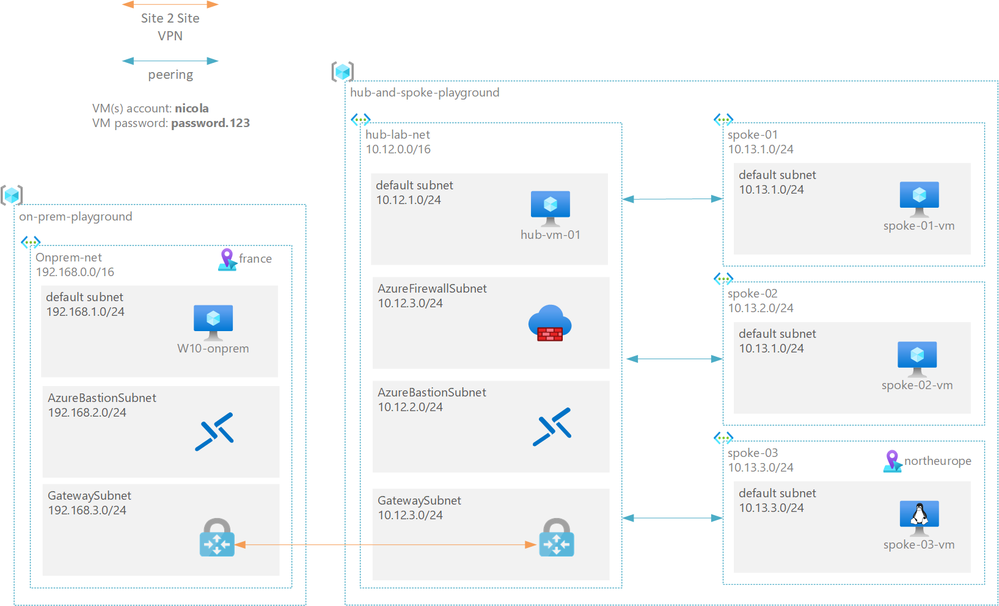

# Create an AZURE hub-and-spoke playground to test configurations and customer scenarios

Read also this [blog post](https://nicolgit.github.io/azure-hub-and-spoke-playground/) for more info on this project.

This repo contains an ARM template to that can be used to deploy a playground composed by:
  * an hub and spoke network topology aligned with with <a href="https://docs.microsoft.com/en-us/azure/cloud-adoption-framework/ready/enterprise-scale/architecture" target="_blank">Microsoft Enterprise scale landing zone</a> reference architecture
  * a simulated on-premise architecture composed by network, client machine(s) and a gateway to be used to test connectivity with the cloud

## Deploy to Azure
You can use the following button to deploy the demo to your Azure subscription:

| playground parts| &nbsp; |
|---|---|
| deploys HUB playground | 
| deploys ON PREMISE playground |  |
| deploys ON PREMISE-2 playground |  |

## Architecture
This diagrams shows the overall architecture:

the ARM template [cloud-deploy](cloud-deploy.json) deploys:
* 4 Azure Virtual Networks:
    * `hub-lab-net` with 4 subnets:
        * default subnet: this subnet is used to connect the hub-vm-01 machine
        * AzureFirewallSubet: this subnet is used by Azure Firewall
        * AzureBastionSubnet: this subnet is used bu Azure Bastion
        * GatewaySubnet: this subnet is used by Azure Gateway
    * `spoke-01` with 1 subnet used to connect spoke-01-vm machine
    * `spoke-02` with 1 subnet used to connect spoke-02-vm machine
    * `spoke-03`, located in North Europe, used to connect spoke-03-vm machine
* An Azure Bastion resource that provides secure and seamless SSH connectivity to the jumpbox virtual machine directly in the Azure portal over SSL
* An Azure Firewall resource that provide a con-premiseic inspection.
* An Azure VPN Gateway resource that is used to send encrypted traffic between the hub virtual network to the on-premises simulated location.
* `hub-vm-01`: a Windows Server virtual machine that simulates a server located in the hub location
* `spoke-01-vm`: a Windows Server virtual machine that simulates a server located in the spoke-01 landing zone
* `spoke-02-vm`: a Windows Server virtual machine that simulates a server located in the spoke-02 landing zone
* `spoke-03-vm`: a Linux virtual machine that simulates a server located in the spoke-01 landing zone

The ARM template [on-prem-deploy](on-prem-deploy.json) deploys:
* `on-prem-net`: an Azure Virtual Network located in France with 3 subnets
    * default subnet: this subnet is used to connect the w10-onprem-vm machine
    * AzureBastionSubnet: this subnet is used bu Azure Bastion
    * GatewaySubnet: this subnet is used by Azure Gateway
* An Azure Bastion resource that provides secure and seamless SSH connectivity to the jumpbox virtual machine directly in the Azure portal over SSL
* An Azure VPN Gateway resource that is used to send encrypted traffic between the hub virtual network to the on-premises simulated location.
* `w10-onprem-vm`: A Windows 10 VM with the objective to simulate a desktop client in an on-premise location

The ARM template [on-prem-deploy-2](on-prem-deploy-2.json) deploys:
* `on-prem-2-net`: an Azure Virtual Network located in Germany with 3 subnets
    * default subnet: this subnet is used to connect the w10-onprem-vm machine
    * AzureBastionSubnet: this subnet is used bu Azure Bastion
    * GatewaySubnet: this subnet is used by Azure Gateway
* An Azure Bastion resource that provides secure and seamless SSH connectivity to the jumpbox virtual machine directly in the Azure portal over SSL
* An Azure VPN Gateway resource that is used to send encrypted traffic between the hub virtual network to the on-premises simulated location.
* `lin-onprem-vm`: A linux VM with the objective to simulate a linux client in an on-premise location

The site to site VPN connection shown in the architecture is not automatically deployed and configure: its configuration is covered by one of the playground scenarios.**est solution**
All machines have the same account parameters (as following):
* username: `nicola`
* password: `password.123`

## Playground's scenarios
Here there is a list of tested scenarios usable on this playground.

For each scenario you have:

* **prerequisites**: component to deploy required to implement the solution (only the hub, also one on-prem playground or both)
* **solution**: a step-by-step sequence to implement the solution
* **test solution**: a procedure to follow, to verify if the scenario is working as expected

| | scenario description | solution |
|---|---|---|
| 1 | Configure the environment to allow VM in any spoke to communicate with any VM in any other spoke | solution using [azure firewall](scenarios/ping-any-to-any-firewall.md)  solution using [azure virtual gateway](scenarios/ping-any-to-any-gateway.md) 
| 2| Expose on a public IP, through the Firewall, `spoke-01-vm` and `spoke-02-vm `RDP port (3389) | solution using [azure firewall dnat](scenarios/dnat-01-02.md)
| 3 | Connect `on-prem-net` with `hub-lab-net` using a vNet-to-vNet Azure Gateway's Connection | solution [vnet-to-vnet](scenarios/vnet-to-vnet.md)
| 4 | Connect `on-prem-net` with `hub-lab-net` using a Site-to-Site (IPSec) Connection | solution with [gateway-ipsec](scenarios/ipsec.md)  solution with [gateway-ipsec-active-active](scenarios/ipsec-active-active.md)
| 5 | Configure a DNS on the cloud, so that all machines are reachable via FQDN |  solution with [azure-dns](scenarios/dns.md)
| 6 | Configure and use Azure Firewall logs for troubleshooting | configure  [log-analytics-on-firewall](scenarios/logs.md)
| 7 | Install a test web server on `spoke-03-vm` | install [web-server](scenarios/web.md) |
| 8 | Connect `on-prem-net` and `on-prem2-net` to `hub-lab-net` via S2S IPSEC and allow cross-on-premises communication | solution [cross-on-premise-routing](scenarios/cross-on-premise-routing.md) |
| 9 | Use Azure Firewall for traffic inspection between `on-prem-net` and `spoke-01` networks  (North/South Traffic Inspection) | solution [north-south-inspection](scenarios/solution-north-south-inspection.md)
| 10 | Use Network Watcher for logging and network troubleshooting | solution [network watcher](scenarios/network-watcher.md)
| 11 | Resolve from on-prem, names of all cloud machines | solution with [Azure Firewall](/scenarios/dns-on-prem.md) | 

Scenarios I will implement in the future:

* Resolve from on-prem, names of all cloud machines, and vice-versa

if you are interested in more scenario, please submit an issue on this repo.