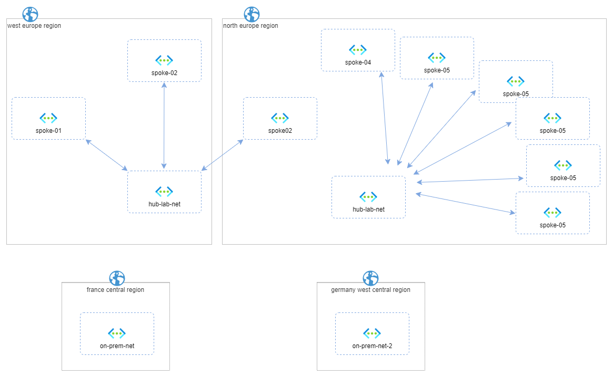
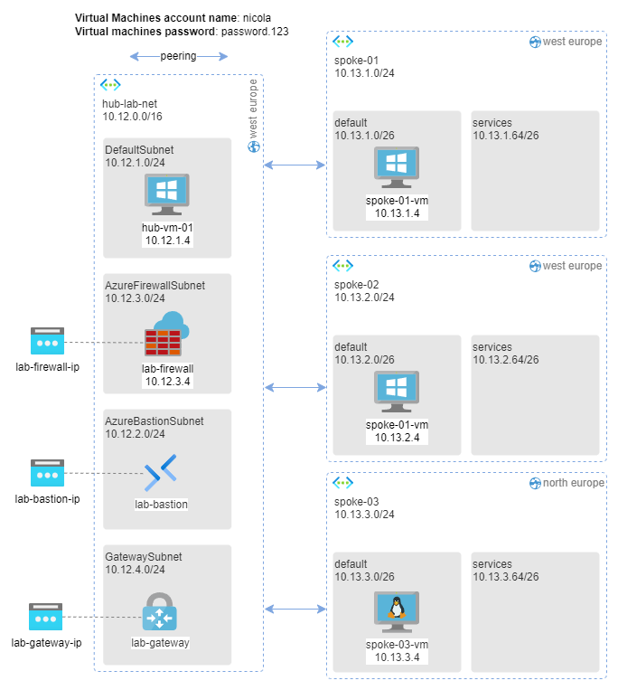
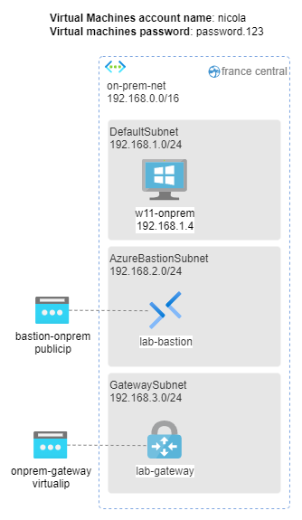
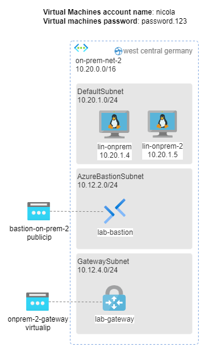
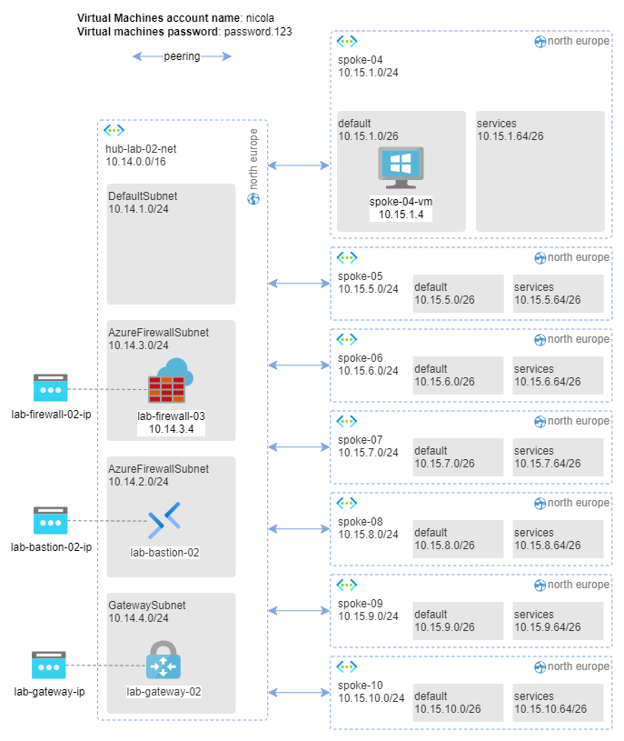

<h1 align="center">
  <br>
  
  <br>
  The Azure🌍 hub-and-spoke-playground
  <br>
</h1>

<h4 align="center">A ready to deploy, well-documented network topology for testing, inventing, learning, and experimenting with Azure networking.</h4>
<p align="center">
  <a href="https://github.com/nicolgit/hub-and-spoke-playground/blob/main/LICENSE">
    
  </a>
  <a href="https://github.com/nicolgit/hub-and-spoke-playground/stargazers">
    
  </a>
  <a href="https://github.com/nicolgit/hub-and-spoke-playground/issues">
    
  </a>
  <a href="https://github.com/nicolgit/hub-and-spoke-playground/graphs/contributors">
    
  </a>
</p>

<p align="center">
  <a href="#features">Features</a> •
  <a href="#quick-start">Quick Start</a> •
  <a href="#architecture">Architecture</a> •
  <a href="#scenarios">Scenarios</a> •
  <a href="#faq">FAQ</a> •
  <a href="#contributing">Contributing</a>
</p>

---

This repository provides a **preconfigured Azure hub-and-spoke network topology** aligned with the [Azure Enterprise-Scale Landing Zone](https://docs.microsoft.com/en-us/azure/cloud-adoption-framework/ready/enterprise-scale/architecture) reference architecture. Deploy it with a single click and use it as a sandbox for testing, studying, and experimenting with network configurations.

> 📖 Read this [blog post](https://nicolgit.github.io/azure-hub-and-spoke-playground/) for more insights about this project.

## Features

- 🏗️ **Enterprise-like topology** — Aligned with Microsoft's Cloud Adoption Framework
- 🚀 **One-click deployment** — Deploy entire environments with a single button
- 🔒 **Security built-in** — Azure Firewall and Azure Bastion automatically deployed
- 🌐 **Multi-region support** — you can deploy the playground in the region you prefer (default west/north europe)
- 📚 **20+ guided scenarios** — Step-by-step tutorials for real-world configurations
- 🔄 **Modular design** — Deploy only what you need (gateway, firewall, bastion, VMs)
- 🎨 **Open-source diagrams** — All architecture diagrams include draw.io source files, ready to customize for your own projects

## Quick Start

### Prerequisites

- An active Azure subscription
- Permissions to create resources in your subscription

### Deploy using the Deploy to Azure Button

|   #   | Playground                                                   |                                                                                                              Deploy                                                                                                              |
| :---: | ------------------------------------------------------------ | :------------------------------------------------------------------------------------------------------------------------------------------------------------------------------------------------------------------------------: |
|   1   | **HUB 01** — Hub network + spokes 01, 02, 03                 |   [](https://portal.azure.com/#create/Microsoft.Template/uri/https%3A%2F%2Fraw.githubusercontent.com%2Fnicolgit%2Fhub-and-spoke-playground%2Fmain%2Fbicep%2Fhub-01.json)   |
|   2   | **ON PREMISES** — Simulated on-prem (France Central)         |  [](https://portal.azure.com/#create/Microsoft.Template/uri/https%3A%2F%2Fraw.githubusercontent.com%2Fnicolgit%2Fhub-and-spoke-playground%2Fmain%2Fbicep%2Fon-prem.json)   |
|   3   | **ON PREMISES 2** — Simulated on-prem (Germany West Central) | [](https://portal.azure.com/#create/Microsoft.Template/uri/https%3A%2F%2Fraw.githubusercontent.com%2Fnicolgit%2Fhub-and-spoke-playground%2Fmain%2Fbicep%2Fon-prem-2.json)  |
|   4   | **ANY-TO-ANY** — Routing + firewall rules *(requires HUB)*   | [](https://portal.azure.com/#create/Microsoft.Template/uri/https%3A%2F%2Fraw.githubusercontent.com%2Fnicolgit%2Fhub-and-spoke-playground%2Fmain%2Fbicep%2Fany-to-any.json) |
|   5   | **HUB 02** — Second hub + spokes 04-10                       |   [](https://portal.azure.com/#create/Microsoft.Template/uri/https%3A%2F%2Fraw.githubusercontent.com%2Fnicolgit%2Fhub-and-spoke-playground%2Fmain%2Fbicep%2Fhub-02.json)   |

### Deploy via Bicep (Azure Cloud Shell)

1. Open [Azure Cloud Shell](https://shell.azure.com) (Bash)

2. Clone the repository:
   ```bash
   git clone https://github.com/nicolgit/hub-and-spoke-playground.git
   cd hub-and-spoke-playground
   ```

3. Set variables for region and resource group name, create the target resource group:
   ```bash
   LOCATION="westeurope"
   RESOURCE_GROUP="hub-and-spoke-playground"

   az group create --name $RESOURCE_GROUP --location $LOCATION
   ```

4. Deploy the playground you need:

   ```bash
   # HUB 01 — Hub network + spokes 01, 02, 03
   az deployment group create --resource-group $RESOURCE_GROUP \
     --template-file hub-01-bicep/hub-01.bicep

   # ON PREMISES — Simulated on-prem (France Central)
   az deployment group create --resource-group $RESOURCE_GROUP \
     --template-file on-prem-bicep/on-prem.bicep

   # ON PREMISES 2 — Simulated on-prem (Germany West Central)
   az deployment group create --resource-group $RESOURCE_GROUP \
     --template-file on-prem-2-bicep/on-prem-2.bicep

   # ANY-TO-ANY — deploys hub-0- + Routing + firewall rules 
   az deployment group create --resource-group $RESOURCE_GROUP \
     --template-file any-to-any-bicep/any-to-any.bicep

   # HUB 02 — Second hub + spokes 04-10
   az deployment group create --resource-group $RESOURCE_GROUP \
     --template-file hub-02-bicep/hub-02.bicep
   ```

> 💡 **Tip**: You can override default parameters using `--parameters paramName=value`

### Cleanup

To destroy all resources and stop incurring costs, simply delete the resource group:

```bash
az group delete --name $RESOURCE_GROUP --yes --no-wait \
  --force-deletion-types Microsoft.Compute/virtualMachines
```

### Default Credentials

All VMs are deployed with:
- **Username:** `nicola`
- **Password:** `password.123`

> ⚠️ **Security Note:** Because this playground is intended to be active for only a few hours without public IPs, I also deploy a default username/password for all VMs. If you prefer, you can change these values to better fit your security standards.

## Architecture

The playground consists of **two hub-and-spoke topologies** and **two simulated on-premises environments** deployed across multiple Azure regions.

<p align="center">
  
  <br/><em>Download the <a href="images/architecture.drawio">draw.io source file</a></em>
</p>

<details>
<summary><b>📦 HUB 01 Components</b> (click to expand)</summary>

Deployed via [`bicep/hub-01.json`](hub-01-bicep/hub-01.json):

| Resource               | Description                                  |
| ---------------------- | -------------------------------------------- |
| `hub-lab-net`          | Hub VNet (West Europe) with 4 subnets        |
| `hub-vm-01`            | VM deployed in `hub-lab-net/default` subnet  |
| `spoke-01`             | Spoke VNet (West Europe) with `spoke-01-vm`  |
| `spoke-02`             | Spoke VNet (West Europe) with `spoke-02-vm`  |
| `spoke-03`             | Spoke VNet (North Europe) with `spoke-03-vm` |
| Azure Bastion          | Secure RDP/SSH access without public IPs     |
| Azure Firewall Premium | Traffic inspection and filtering             |
| VPN Gateway            | Hybrid connectivity to on-premises           |



_Download the [draw.io source file](images/architecture.drawio)_

</details>

<details>
<summary><b>📦 ON PREMISES Components</b> (click to expand)</summary>

Deployed via [`bicep/on-prem.json`](on-prem-bicep/on-prem.json):

| Resource        | Description                                  |
| --------------- | -------------------------------------------- |
| `on-prem-net`   | VNet (France Central) simulating on-premises |
| `w10-onprem-vm` | Windows 11 client VM                         |
| Azure Bastion   | Secure access                                |
| VPN Gateway     | S2S connectivity to hub                      |



_Download the [draw.io source file](images/architecture.drawio)_

</details>

<details>
<summary><b>📦 ON PREMISES 2 Components</b> (click to expand)</summary>

Deployed via [`bicep/on-prem-2.json`](on-prem-2-bicep/on-prem-2.json):

| Resource        | Description                                               |
| --------------- | --------------------------------------------------------- |
| `on-prem-2-net` | VNet (Germany West Central) simulating second on-premises |
| `lin-onprem`    | 1st Linux client VM                                       |
| `lin-onprem-2`  | 2nd Linux client VM                                       |
| Azure Bastion   | Secure access                                             |
| VPN Gateway     | S2S connectivity to hub                                   |



_Download the [draw.io source file](images/architecture.drawio)_

</details>

<details>
<summary><b>📦 HUB 02 Components</b> (click to expand)</summary>

Deployed via [`hub-02-bicep/hub-02.json`](bicep/hub-02.json):

| Resource                 | Description                    |
| ------------------------ | ------------------------------ |
| `hub-lab-02-net`         | Second hub VNet (North Europe) |
| `spoke-04` to `spoke-10` | Seven additional spoke VNets   |
| Azure Firewall Standard  | Traffic filtering              |
| Azure Bastion            | Secure access                  |
| VPN Gateway              | Hybrid connectivity            |



_Download the [draw.io source file](images/architecture.drawio)_

</details>

<details>
<summary><b>📦 ANY-TO-ANY Routing</b> (click to expand)</summary>

Deployed via [`bicep/any-to-any.json`](any-to-any-bicep/any-to-any.json):

- Route tables forwarding spoke traffic through the firewall
- IP Groups and Azure Firewall policies enabling:
  - ✅ Spoke-to-spoke communication
  - 🚫 Blocked web categories (nudity, child inappropriate, pornography)
  - ✅ Allowed HTTP(S) outbound traffic

</details>

## Scenarios

Each scenario includes **prerequisites**, **step-by-step solution**, and **validation tests**.

### Connectivity & Routing

|   #   | Scenario                             | Solutions                                                                                                                                                                                                                                                                                                             |
| :---: | ------------------------------------ | --------------------------------------------------------------------------------------------------------------------------------------------------------------------------------------------------------------------------------------------------------------------------------------------------------------------- |
|   1   | Any-to-any spoke communication       | implemented using [Azure Firewall](scenarios/ping-any-to-any-firewall.md) • implemented using [VNet Gateway](scenarios/ping-any-to-any-gateway.md) • implemented using [AVNM](scenarios/ping-any-to-any-avnm.md)                                                                                                      |
|   3   | Connect on-premises via VNet-to-VNet | implemented using VNet-to-VNet connection [to on-premise](scenarios/vnet-to-vnet.md) • implemented using VNet-to-VNet connectio [to on-premises-2](scenarios/vnet-to-vnet-2.md)                                                                                                                                       |
|   4   | Site-to-Site IPSec VPN               | one connection [without BGP](scenarios/ipsec.md) • one connection [With BGP](scenarios/ipsec-bgp.md) • dual connection [Active-Active with bgp](scenarios/ipsec-active-active.md) • [Dual Redundancy](scenarios/ipsec-dual-redundancy.md) • [Multiple Devices TO BE REVIEWED](scenarios/ipsec-multiple-vpn-device.md) |
|   8   | Cross on-premises communication      | implemented with [Vnet-to-Vnet connection via Hub and BGP](scenarios/cross-on-premise-routing.md)                                                                                                                                                                                                                     |
|  14   | Routing cross hubs with BGP          | via [VNet Gateway](scenarios/routing-with-bgp.md)                                                                                                                                                                                                                                                                     |
|  15   | Routing cross hubs without BGP       | via [Azure Firewall](scenarios/routing-without-bgp-fw.md)                                                                                                                                                                                                                                                             |

### Security & Traffic Inspection

|   #   | Scenario                         | Solutions                                                                     |
| :---: | -------------------------------- | ----------------------------------------------------------------------------- |
|   2   | Expose VMs via Firewall DNAT     | [DNAT Rules](scenarios/dnat-01-02.md)                                         |
|   9   | North/South traffic inspection   | using [Azure Firewall](scenarios/solution-north-south-inspection.md)          |
|  12   | Secure web workloads             | using [Azure Firewall + Application Gateway WAF](scenarios/publish-waf-fw.md) |
|  20   | Manage outbound internet traffic | using [Azure Firewall](scenarios/outbound-traffic-to-internet-firewall.md)    |

### DNS & Name Resolution

|   #   | Scenario                        | Solutions                                                                                                                                           |
| :---: | ------------------------------- | --------------------------------------------------------------------------------------------------------------------------------------------------- |
|   5   | Cloud DNS for FQDN resolution   | [Azure DNS](scenarios/dns.md)                                                                                                                       |
|  11   | DNS resolution from on-premises | [Azure Firewall](scenarios/name-resolution-with-azure-firewall.md) • [Private DNS Resolver](scenarios/name-resolution-with-dns-private-resolver.md) |

### Publishing & Services

|   #   | Scenario                       | Solutions                                                                                                                  |
| :---: | ------------------------------ | -------------------------------------------------------------------------------------------------------------------------- |
|   7   | Deploy test web server         | [Web Server](scenarios/web.md)                                                                                             |
|  13   | Point-to-Site VPN              | using [Certificate Auth](scenarios/p2s-vpn-certificate.md) • using [Always-On](scenarios/p2s-vpn-certificate-always-on.md) |
|  16   | Publish internal web apps      | using [Application Gateway](scenarios/app-gateway-01.md) • using [Azure Front Door](scenarios/frontdoor.md)                |
|  17   | Publish SFTP endpoint          | using [Azure Firewall](scenarios/sftp.md)                                                                                  |
|  18   | Azure OpenAI with private APIM | using [APIM + AOAI](scenarios/aoai.md)                                                                                     |
|  19   | Azure Elastic SAN              | usingn [Azure Elastic SAN](scenarios/elastic-san.md)                                                                       |

### Monitoring & Troubleshooting

|   #   | Scenario                | Solutions                                       |
| :---: | ----------------------- | ----------------------------------------------- |
|   6   | Azure Firewall logs     | [Log Analytics](scenarios/logs.md)              |
|  10   | Network troubleshooting | [Network Watcher](scenarios/network-watcher.md) |

> 💡 **Missing a scenario?** [Open an issue](https://github.com/nicolgit/hub-and-spoke-playground/issues) and let us know!

## FAQ

<details>
<summary><b>How much does it cost to run this playground?</b></summary>

The cost depends on the components you deploy and how long you keep them running. The main cost drivers are:
- **Azure Firewall Premium**: ~$1.75/hour
- **VPN Gateway (VpnGw1)**: ~$0.19/hour
- **Virtual Machines**: varies by SKU (Standard_D2_v5 ~$0.10/hour)
- **Azure Bastion**: ~$0.19/hour

💡 **Tip**: Delete the resource group when not in use to avoid unexpected charges and redeploy it when you need it, this is the real value of this project!

</details>

<details>
<summary><b>Can I use this in production?</b></summary>

This playground is designed for learning and testing purposes. While it follows enterprise-scale landing zone patterns, you should review and adapt security settings, naming conventions, and SKUs before using it in a production environment.

</details>

<details>
<summary><b>Where can I find the source files for the network diagrams? What software do you use for the diagrams?</b></summary>

All diagrams are created with [draw.io](https://draw.io) and the source files are available in the [`images/`](images/) folder with `.drawio` extension. You can download them and use them as a starting point for your own architecture diagrams — same style, same icons!

</details>

## Contributing

Contributions are welcome! Please read our [Contributing Guide](CONTRIBUTING) and [Code of Conduct](CODE_OF_CONDUCT.md) before submitting a PR.

## License

This project is licensed under the MIT License — see the [LICENSE](LICENSE) file for details.

---

<p align="center">
  Made with ❤️ in Italy 🇮🇹 by <a href="https://github.com/nicolgit">nicolgit</a><br/>
  Powered by <a href="https://github.com/nicolgit/hub-and-spoke-playground/contributors">contributors</a> from around the world
</p>

