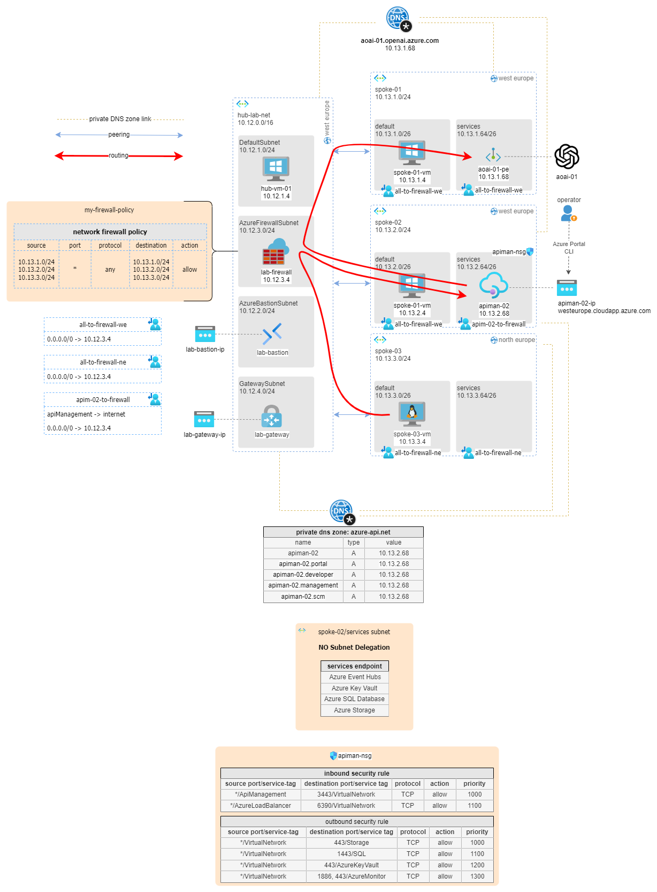

# SOLUTION: deploy an Azure OpenAI service in an hub-and-spoke network topology and publish it internally via Azure API Management

Azure OpenAI offers a suite of AI models and tools that help in developing applications that can understand and interpret human language. It's recommended to have a single OpenAI instance within an enterprise to streamline operations, reduce redundancy, and ensure consistent AI performance across multiple applications.

A common API Manager plays a pivotal role in the enterprise ecosystem. It provides a unified interface for designing, building, managing, and scaling APIs, thereby enhancing the interconnectivity between different applications. The benefits include improved efficiency, better control over data flow, and enhanced security through standardized protocols.

Enterprises are encouraged to use the Hub and Spoke network architecture. This model allows a central 'hub' to connect with multiple 'spokes' or peripheral networks, promoting efficient data transfer and communication. It offers advantages such as reduced latency, better traffic management, and enhanced security, making it an ideal choice for enterprises seeking to optimize their cloud computing capabilities.

**In this solution, I show a configuration where, in a classic hub & spoke context, a client accesses an OpenAI endpoint through an Azure API Manager (APIM). The three elements are installed in 3 different spokes connected to a hub network.**

Specifically:
* All traffic through the spokes is made possible by an appropriately configured Azure Firewall.
* Azure OpenAI Service is exclusively exposed within a network thanks to an Azure Private Endpoint.
* APIM is configured in virtual network integration 'internal mode', this means that API Management deployment is set up inside a Virtual Network having an **Intranet Facing Endpoint only**.
* Open AI, APIM, and the client are configured on 3 different spokes, and all traffic is orchestrated through an Azure Firewall in the HUB.

In this configuration, APIM is a pivotal element of the entire cloud infrastructure, therefore potentially accessible both from on-premise (via VPN/Express route) and from additional spokes in the same network. Similarly, a configuration of this type allows exposing any API present in one of the other spokes or even present on-premise, if the routing allows it.

OpenAI configuration through internal exposure is relatively less complex as in this case it is sufficient to:

* expose the service via an Azure Private endpoint
* close public access
* configure the internal DNS to resolve the public name of the API towards the IP of the service's private endpoint
* link the private DNS zone to all networks that need to access this API, in our case `spoke-01`, `spoke-02` (APIM), and `hub-net`.

The configuration of APIM, on the other hand, is more complex. APIM is a service that is composed of, and interacts with numerous other Azure infrastructure components, so the private deployment exposes us to challenges that we need to solve:

* A network security group attached to the APIM subnet is required to explicitly allow inbound connectivity, because the load balancer used internally by API Management is secure by default and rejects all inbound traffic.
* enable service endpoints in the subnet to dependent services such as  Key Vault, Azure Storag, Event Hubs and Azure SQL.
* A Standard SKU public IPv4 address. The public IP address in this configuration is used only for management operations
* a Private DNS zone is also required to resolve internal APIM endpoints

the final architecture is shown in the image below.

_download drawio version of this image [here](../images/aoai-deployment.drawio)._

The following figure instead represents the flows required by APIM for its correct operation in **network internal mode**.

_download drawio version of this image [here](../images/aoai-deployment.drawio)._

## Pre-requisites

In order to apply this solution you have to deploy the `hub-01` and the `any-to-any` routing, so that you have a fully configured hub-and-spoke network with firewall and routing between spokes, as shown in the picture below.

[HUB AND SPOKE con routing tra gli spoke]

Aggiungeremo ora un Azure API Manager (APIM) nella subnet services nello spoke-02, ed un Azure OpenAI service nella subnet services nello spoke-01.

## Solution

### Deploy Azure OpenAI Service
Go to Azure Portal > Azure AI | Azure OpenAI > Create
* region: West Europe
* Name: `aoai-01`
* pricing tier: `standard S0`

Network
* Type: `disabled`
* add private endpoint
  * Location: west europe
  * Name: `aoai-01-pe`
  * Virtual Network: `spoke-01`
  * Subnet: `services`
  * Integrate with private dns zone: No
* click [create]

Go to Azure Portal > private DNS zone > create
* name: `aoai-01.openai.azure.com`
* Click [Create] 

Take note ok the `KEY1` found in Resource Management >Keys and Endpoint > KEY1.

Go to Azure Portal > Private DNS zones > `aoai-011.openai.azure.com` > + Record set

* Name: `*`
* Type: `A`
* IP: `10.13.1.68` (Azure Open AI private endpoint IP)
* Click [OK]

Go to Virtual Network links > Add
* name: `spoke-01-link`
* subnet `spoke-01`
* click [OK]

Go to Virtual Network links > Add
* name: `spoke-02-link`
* subnet `spoke-02`
* click [OK]

### Deploy a model
Go to Portal > Azure AI | Azure OpenAI > `aoai-01` > Azure Open AI Studio > Deplymments > Create

* Model: gpt-35-turbo
* Name `mygpt`
* click [Create]

### API Management Service public IP
Go to Azure Portal > Public IP addresses > Create

Basic
* Region: West Europe
* Name: `apiman-ip-02`
* IP version: `v4`
* SKU: `standard`
* DNS name label: `apiman-02-ip`
* click [create]

### API Management subnet NSG
Go top Azure Portal > Network security groups > create
* Name: `apiman-nsg`
* Region: Wer Europe
* click [create]

Go to Azure Portal > Network security groups > `apiman-nsg` > subnets > associate:
* virtual network: `spoke-02`
* subnet: `services`

### Api Management Service Instance
Go to Azure Portal > API Management Service > Create

Basics
* Region: West Europe
* Name: `apiman-02`
* Organization: `contoso`
* Organization email: `admin@contoso.com`
* Tier: Developer

Virtual Network
* Connectivity Type: `virtual network`
* Type: `internal`
* Virtual Network: `spoke-02`
* Subnet: `Services`
* public ip address: `apiman-ip-02`
* click [create]

### Import OPEN AI Rest interface in APIM using his swagger specification
Azure OpenAI provides you with REST API references, that can easily be imported into Azure API Management. In this scenario we will implement only the completition endpoint.

* download [completition endpoint swagger specification](https://learn.microsoft.com/en-us/azure/ai-services/openai/reference#completions) from Microsoft

....................

### configure API Key in API configuration

...................

## Test solution
Connect via bastion/ssh to spoke-03-vm and type the following:

......................................................

## More information

* Deploy your Azure API Management instance to a virtual network - internal mode https://learn.microsoft.com/en-us/azure/api-management/api-management-using-with-internal-vnet?tabs=stv2 
  
* Azure Open AI https://learn.microsoft.com/en-us/azure/ai-services/openai/
* Azure API Management Service https://learn.microsoft.com/en-us/azure/api-management/ 
  * vnet internal deployment: https://learn.microsoft.com/en-us/azure/api-management/api-management-using-with-internal-vnet
* Private endpoint https://learn.microsoft.com/en-us/azure/private-link/private-endpoint-overview
* Publish Open AI via APIM https://techcommunity.microsoft.com/t5/apps-on-azure-blog/build-an-enterprise-ready-azure-openai-solution-with-azure-api/ba-p/3907562 

