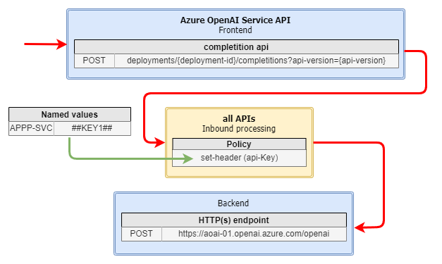

# SOLUTION: deploy a private Azure API Management stv1 platform in one spoke

In this solution, I will show how to deploy an APIM version stv1 in a virtual private network.


APIM configuration, on the other hand, is more complex. APIM is a service that is composed of, and interacts with, numerous other Azure infrastructure components, so the private deployment exposes us to challenges that we need to solve:

* A **network security group** attached to the APIM subnet is required to explicitly allow inbound connectivity because the load balancer used internally by API Management is secure by default and rejects all inbound traffic.
* **Service endpoints** in the subnet to dependent services such as Azure Storage, Event Hubs, and Azure SQL are also required because, in this context, the user route (`0.0.0.0/0`) through the Azure firewall would interrupt connectivity with API Management.
* A Standard SKU **public IPv4** address. The public IP address in this configuration is used only for management operations.
* A **Private DNS zone** is also required to resolve internal APIM endpoints.

the final architecture is shown in the image below.

.....


## Pre-requisites

In order to apply this solution you have to deploy the `hub-01` and the `any-to-any` routing, so that you have a fully configured hub-and-spoke network with firewall and routing between spokes.

## Solution
We will do the following:

* Deploy and configure an Azure API Manager (APIM) in the `services` subnet of `spoke-02` network.


Go to Azure Portal > Azure AI | Azure OpenAI > Create
* region: West Europe
* Name: `aoai-01`
* pricing tier: `standard S0`

Network
* Type: `disabled`
* add private endpoint
  * Location: west europe
  * Name: `aoai-01-pe`
  * Virtual Network: `spoke-01`
  * Subnet: `services`
  * Integrate with private dns zone: No
* click [create]

Take note ok the `KEY1` found in Resource Management > Keys and Endpoint > KEY1.

Go to Azure Portal > private DNS zone > create
* name: `aoai-01.openai.azure.com`
* Click [Create] 

Go to Azure Portal > Private DNS zones > `aoai-01.openai.azure.com` > + Record set

* Name: `*`
* Type: `A`
* IP: `10.13.1.68` (Azure Open AI private endpoint IP)
* Click [OK]

Go to Virtual Network links > Add
* name: `spoke-01-link`
* subnet `spoke-01`
* click [OK]

Go to Virtual Network links > Add
* name: `spoke-02-link`
* subnet `spoke-02`
* click [OK]

### API Management Service public IP
Go to Azure Portal > Public IP addresses > Create

Basic
* Region: West Europe
* Name: `apiman-ip-02`
* IP version: `v4`
* SKU: `developer` (stv1)
* DNS name label: `apiman-02-ip`
* click [create]

### API Management subnet NSG
Go top Azure Portal > Network security groups > create
* Name: `apiman-nsg`
* Region: `West Europe`
* click [create]

add the following inbound rules

| priority | name | port src/dst | protocol | source/service tag | destination/service tag | action |
|----|----|----|----|----|----|----|
| 1000 |apimanagement-inbound | */3443| TCP | ApiManagement | Virtual Network| Allow
| 1100 |mgmt-endpoint-portal | */ * | TCP | AzureLoadBalancer | VirtualNetwork | allow


add the following outbound rules

| priority | name | port src/dst | protocol | source/service tag| destination/service tag | action |
|----|----|----|----|----|----|----|
| 1000 |to-storage | */443| TCP | Virtual Network | Storage| Allow
| 1100 |to-sqlserver | */1443| TCP | Virtual Network | Sql| Allow
| 1200 |to-azuremonitor | */1886,443| TCP | Virtual Network | Azure Monitor| Allow

Go to Azure Portal > Network security groups > `apiman-nsg` > subnets > associate:
* virtual network: `spoke-02`
* subnet: `services`

### API Management subnet route table
Go to Azure Portal > Route Table > Create

* Region: West Europe
* Name: `apim-02-to-firewall`
* click [create]

Go to Azure Portal > Route Table > `apim-02-to-firewall` > Routes > Add

| Name          | Type           | Addr prefix   | next hope type    | next hope ip addr |
|----|----|---|----|----|
| apim2internet | Service Tag    | ApiManagement | internet          |                   |
| 2firewall     | Ip Addresses   |0.0.0.0/0     | virtual appliance | 10.12.3.4         |

Go to Azure Portal > Virtual Networks > `Spoke-02` > subnets > `services`

* Route Table: `apim-02-to-firewall`
* click [save]

### API Management subnet Service Endpoints

Go to Azure Portal > Virtual Networks > `Spoke-02` > subnets > `services` > Endpoints > add

* Microsoft.EventHub
* Microsoft.Sql
* Microsoft.Storage
  
Click [save]

### Api Management Service Instance
Go to Azure Portal > API Management Service > Create

Basics
* Region: `West Europe`
* Name: `apiman-02`
* Organization: `contoso`
* Organization email: `admin@contoso.com`
* Tier: `Premium` (stv1)
* click [create]

Go to Azure Portal > API Management Service > `apiman-02` > Network > Virtual Network:

* Virtual Network: `internal`
* Location: `West Europe`
* Virtual Network: `spoke-02`
* Management public IP address: `apiman-ip-02`
* subnet : `services`
* click [save]
  


Go to Azure Portal > private DNS zone > create
* name: `azure-api.net`
* Click [Create] 

Go to Azure Portal > Private DNS zones > `azure-api.net` > + Record set

| Name | Type | IP | 
|----|----|----|
| `apiman-02` | A | `10.13.2.68` |
| `apiman-02.portal` | A | `10.13.2.68` |
| `apiman-02.developer` | A | `10.13.2.68` |
| `apiman-02.management` | A | `10.13.2.68` |
| `apiman-02.scm` | A | `10.13.2.68` |


Go to Virtual Network links > Add
* name: `spoke-03-link`
* subnet `spoke-03`
* click [OK]

Go to Virtual Network links > Add
* name: `spoke-02-link`
* subnet `spoke-02`
* click [OK]

Go to Virtual Network links > Add
* name: `hub-link`
* subnet `hub-lab-net`
* click [OK]


### Import OpenAI Rest interface in APIM using its swagger specification

Azure OpenAI provides you with REST API references, that can easily be imported into Azure API Management. In this scenario we will expose via APIM the **completition endpoint**.

* download the swagger specification (`swagger.json`) for the API version you want to expose from [the official AOAI endpoint swagger specifications](https://learn.microsoft.com/en-us/azure/ai-services/openai/reference#completions) i.e. `2022-12-01`
* replace '{endpoint}' string  with your deployed api

```
(Get-Content .\swagger.json).Replace('{endpoint}', 'aoai-01.openai.azure.com') | Set-Content .\swagger.json
```

Go to Azure Portal > API Management Services > `apiman-02` > APIs > create from definition > Open API > upload `swagger.json` file > create

Azure OpenAI is protected using the concept of API keys. An API key is a unique access code that acts as a secure identifier. We will use Azure API Management policies to append an API key to our operations. 

Go to Azure Portal > API Management Services > `apiman-02` > APIs > All Operations > Inbound processing > Policy > Edit and insert the following XML

```
<policies>
    <inbound>
        <set-header name="api-key" exists-action="override">
            <value>{{APPPSVC-KEY}}</value>
        </set-header>
    </inbound>
    <backend>
        <forward-request />
    </backend>
    <outbound />
    <on-error />
</policies>
```

For security reasons, we want to use Named values in Azure API Management and don’t paste the API key directly into our policy. 

For this go to Azure Portal > API Management Services > `apiman-02` > Named Values > Add

* Name: `APPSVC-KEY`
* Display Name: `APPPSVC-KEY`
* Type: Secret
* Value: `KEY1` (the KEY1 value you taken above from Open AI)
* click [SAVE]

Now disable subscription key required at API level, so that we can easily test the call in our environment.

For this open Azure Portal > API Management Services > `apiman-02` > `Azure OpenAI Service API` > Settings > Subscription: 

* Subscription Required > `NO`
* click [SAVE]



_download drawio version of this image [here](../images/aoai-deployment.drawio)._


## Test solution
Finally, you are able to test your API call in Azure API Management. 

Connect via bastion/RDP to `spoke-02-vm` and test API call locally.

Open Azure Portal > API Management Services > `apiman-02` > `Azure OpenAI Service API` > Test Tab > Test `Create a completition...`

* deployment-id: `mygpt`
* api-verison: `2022-12-01`
* click [Send]

you should receive an HTTP 200 answer. 

Connect via bastion/ssh to `spoke-03-vm` and type the following:

```
curl https://apiman-02.azure-api.net/deployments/mygpt/completions?api-version=2022-12-01\
  -H "Content-Type: application/json" \
  -d "{
  \"prompt\": \"Once upon a time\",
  \"max_tokens\": 50
}"

```
you should receive a json message coming from Azure Open AI. 


> {"id":"cmpl-8ugbMFmX3n2P...","object":"text_completion","created":...,"model":"gpt-35-turbo-instruct","choices":[{"text":" some scadians dressed themselves as “lawmen” and rode out to confront the proprietors of Masker’s Serpent. They “remained a few minutes” and left. No one was arrested. No one does anything on Cape Cod that anyone","index":0,"finish_reason":"length","logprobs":null}],"usage":{"prompt_tokens":4,"completion_tokens":50,"total_tokens":54}}

## More information


* Azure API Management Service https://learn.microsoft.com/en-us/azure/api-management/ 
  * vnet internal deployment: https://learn.microsoft.com/en-us/azure/api-management/api-management-using-with-internal-vnet
  *  Deploy your Azure API Management instance to a virtual network - internal mode https://learn.microsoft.com/en-us/azure/api-management/api-management-using-with-internal-vnet?tabs=stv2 
  
* Private endpoint https://learn.microsoft.com/en-us/azure/private-link/private-endpoint-overview
* Publish Open AI via APIM https://techcommunity.microsoft.com/t5/apps-on-azure-blog/build-an-enterprise-ready-azure-openai-solution-with-azure-api/ba-p/3907562 
* Understanding Azure API Management policies: https://learn.microsoft.com/en-us/azure/api-management/api-management-howto-policies 


