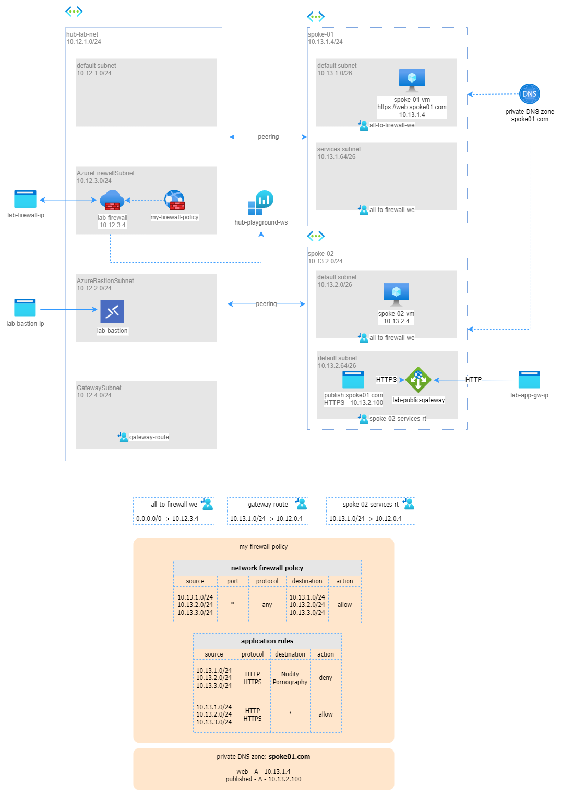

# SOLUTION - publish internal web app via Azure Application Gateway on private and public IPs

In this solution I show how to expose through Azure Application Gateway both externally (internet) in HTTP and internally (intranet) in HTTPS an HTTPS web service delivered by a windows VM, with a certificates emitted by a privare certification authority.

The service is exposed by the Azure Application Gateway, via HTTP and HTTPS, (both externally and internally).  

The scenario is deployed into a Hub and Spoke network topology context. Specifically, the virtual network that hosts the Web Service VM is different from the virtual network that hosts the Azure Application Gateway.

Traffic between these 2 spokes is secured by an Azure Firewall in the hub virtual network.

In this configuration, inbound web traffic goes through both Azure Firewall and WAF. The WAF provides protection at the web application layer. Azure Firewall acts as a central logging and control point, and it inspects traffic between the Application Gateway and the backend servers. With Azure Firewall Premium, this design can support end-to-end scenarios, where the Azure Firewall applies TLS inspection to do IDPS on the encrypted traffic between the Application Gateway and the web backend.

This design is appropriate for applications that need to know incoming client source IP addresses, for example to serve geolocation-specific content or for logging. Application Gateway in front of Azure Firewall captures the incoming packet's source IP address in the X-forwarded-for header, so the web server can see the original IP address in this header. 

The resulting overall architecture is shown in the following schema.


_download drawio version of this image [here](../images/app-gateway-01.drawio)._

## Pre-requisites
In order to apply this solution you have to deploy the `hub-01` and the `any-to-any` routing, so that you have a fully configured hub-and-spoke network with firewall and routing between spokes.

## Solution

The steps to configure the solution are as follows:

1. generate 2 self signed certificate
2. Create a DNS private zone
3. configure spoke-01-vm as HTTPS orgin web site
4. configure the Azure Application Gateway

### Generate 2 certificates
We will use `mkcert` to generate 2 certificates:

* `web.spoke01.com`: the HTTPS name for web server
* `published.spoke01.com`: the HTTPS name for the application Gateway private Front-End

Install [mkcer](https://github.com/FiloSottile/mkcert) to create a local certification authority and generate 2 web certificates.

```
mkcert -install
mkcert -pkcs12 web.spoke01.com
mkcert -pkcs12 published.spoke01.com
```

this will create 2 files

```
web.spoke01.com.p12
published.spoke01.com.p12
```

rename `published.spoke01.com.p12` to `published.spoke01.com.pfx` (_p12 and pfx file format are the same, but Azure Application gateway requires this extension!_)

Convert root certificate in .cer, so we can load in Azure Application Gateway
```
mkcert -CAROOT

openssl x509 -inform PEM -in <rootCA.pem-file-path> -outform DER -out rootCA.cer
```

### Configure the private DNS Zone
Create a DNS private zone.
From Azure Portal >  Private DNS Zones > Create:
* name: `spoke01.com`
* click **Create**

In this private DNS zone create 2 A records:

| name | type | ipaddress |
|---|---|---|
| `web` | `A` | `10.13.1.4` |
| `published` | `A` | `10.13.2.100` |

unded Virtual Network Links, add 2 links:

| link name | virtual network | enable auto registration |
|---|---|---|
| `spoke-01-link` | `spoke-01` | NO |
| `spoke-02-link` | `spoke-02` | NO |

### configure `spoke-01-vm` as HTTPS orgin web site

Install the certificate `web-on-spoke-01` on `spoke-01-vm`

* right-click > Install PFX
* select: `local machine`
* password: `changeit`
* set: mark this key as exportable
* set: include all extended properties
* set: automatically select the certificate store

Configure IIS on `spoke-01-vm`, from Windows server mamager:
* add roles and features
* select web server (IIS)
* click «**Install**»

Configure SSL web site: from Internet Information Services > Default Web Site > SSL Settings > Bindings > Add:
* Type: `https`
* IP address: `10.13.1.4`
* hostname: `web.spoke01.com`
* SSL certificate: `web.spoke01.com`

Test web site and connection: from `spoke-02-vm` brose with Microsot Edge tp https://web.spoke01.com/
you will receive a "_your connection isn't private_" message. Go to advanced> ignore to see the IIS web site.

### Configure the Azure Application Gateway

It is required to create a new routing table on Application Gateway subnet that allows direct traffic to internet. From Azure Portal > Route tables > Create 
* region: `west europe`
* name: `spoke-02-services-rt`
* click **create**

When the route table is created, goes to Settings > Routes > add:
* name: `to-hub`
* destination type: **IP address**
* IPs: `10.13.1.0/24`
* next hop: `Virtual Appliance`
* IP: `10.12.3.4`

Associate this route table to (Azure Portal > `spoke-02` > subnets):
* vnet: `spoke-02`
* subnet: `services`

Create an Azure Application Gateway: From Azure Portal > Aplication Gateways > Create Application Gateway:
* Name: `lab-public-gateway`
* region: `west europe`
* tier: `standard V2`
* Virtual network: `spoke-02`
* subnet: `services`
* FrontEnd
	* Address type: `both`
	* public IP Name (**new**): `lab-app-gw-ip`
	* private IP Address: `10.13.2.100`
* Backends > add backend pool 
	* Name: `spoke-01-pool`
	* IP/FQDN: `10.13.1.4`
* Configuration > Add a routing rule
	* name: `spoke-01-rule`
	* priority: `1000`
	* Listener
		* Name: `listener-public`
		* frontend IP: `public`
		* protocol: `http`
		* listener type: `basic`
	* backend targets
		* type: `backend pool`
		* backend target: `spoke-01-pool`
		* backend settings > add new:
			* name: `spoke-01-settings`
			* backend protocol: `https`
			* Use well known CA certificate: `NO`
			* CER certificate: **rootCA.cer** file
			* override backend path: 
			* override with new hostname: `yes`
			* hostname: `web.spoke01.com`
			* create custom probes: `no`
			* click **ADD**
* Review and Create > **Create**

Once the Application Gateway is created, add the internal listener and routing rule

From your Azure Applicationg Gateway > Settings > Listers > Add Listener:
* Name: listener-private
* Front end IP: private
* protocol: HTTPS
* Certificate > Add
  * upload a certificate
  * cert name: published-certificate
  * PFX File: `published.spoke01.com.pfx` created above
  * password: `changeit`
  * listener-type: basic
  * click **ADD**

From your Azure Applicationg Gateway > Settings > Rules > Add Routing Rule:
* Name: Rule-internal
* Priority: 2000
* Listener: Listener-private
* Backend Targets
  * target-type: backend-pool
  * backend-target: spoke-01-pool
  * backend-settings: spoke-01-settings
  * click 
  
## Test solution

From your local machine open a browser and type _http://<lab-public-gateway Frontend public IP address>/_
From spoke-02-vm open Edge ant type https://published.spoke01.com/: you will receive a "_your connection isn't private_" message. Go to advanced > ignore to see the IIS web site.

## More information

* How Application Gateway works: https://learn.microsoft.com/en-us/azure/application-gateway/how-application-gateway-works
* Firewall topologies: https://learn.microsoft.com/en-us/azure/architecture/example-scenario/gateway/firewall-application-gateway
* local personal certification authority: https://github.com/FiloSottile/mkcert 
* use mkcert with IIS: https://medium.com/@aweber01/locally-trusted-development-certificates-with-mkcert-and-iis-e09410d92031 
* 
