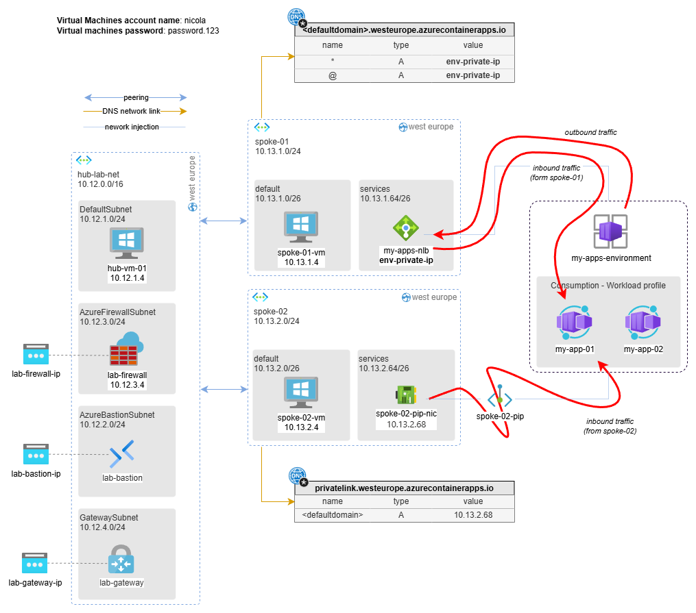

# SOLUTION: Deploy an Azure Container Apps Environment fully internal

[Azure Container Apps](https://learn.microsoft.com/en-us/azure/container-apps/overview) (ACA) is a fully managed serverless container platform that enables you to run microservices and containerized applications without managing infrastructure. It supports scale-to-zero, event-driven autoscaling, built-in traffic splitting, and integrates with Dapr for distributed application patterns. Container Apps environments can be deployed into a virtual network for private, internal-only access.

The goal of this walkthrough is to deploy an Azure Container Apps instance in a hub-and-spoke network topology. The containerized application is deployed in **internal** mode — this means it can only be accessed from machines connected to the internal network and has no public endpoint.

In this configuration, we have to consider 2 distinct network flow types:

1. **Traffic inbound**: this is the traffic produced when a client, i.e., `spoke-vm-01`, calls a web app (`my-app-01`) hosted on ACA.
2. **Traffic outbound**: this is the traffic produced when an app hosted on ACA calls an internal server exposed on the internal network (i.e., a SQL Server installed on `spoke-vm-01`).

In this scenario, we will implement:

* Network injection: allows both ACA inbound and outbound traffic.
* Private endpoint: allows only ACA inbound traffic.

Outbound traffic management is possible thanks to subnet delegation.

> ⚠️ **Subnet delegation** in Azure virtual networks enables you to designate a specific subnet for an Azure PaaS service of your choice that needs to be injected into your virtual network. This feature provides full control to customers on managing the integration of Azure services into their virtual networks, ensuring better performance and security.

The resulting overall architecture is shown in the following schema. In the case of integration on the `spoke-01` network, we have implemented an inbound/outbound integration, while on `spoke-02` we have only implemented an inbound traffic integration.

_Download the drawio version of this image [here](../images/container-apps.drawio)._

> This configuration is purely for educational purposes; the settings shown here are only indicative, and many other options are available. For example, to allow spoke-vm-02 access to the applications hosted on ACA, instead of using a private endpoint, you could also route the traffic through the central firewall.

## Pre-requisites

In order to apply this solution, you need to deploy `hub-01` with all default parameters.

## Solution

### Create `my-app-01` and environment

Go to Azure Portal > Container Apps > Create:

BASIC

* Container app name: `my-app-01`
* Deployment source: `container image`
* Region: `West Europe`
* Container Apps environment > Create new environment:
  * Name: `my-apps-environment`
  * Logs > Log Analytics workspace: `hub-playground-ws`
  * Network > Public Access: `Disable`
  * Network > Virtual Network:
    * Use your own virtual network: `Yes`
    * Virtual Network: `spoke-01`, Subnet: `services`
    * Virtual IP: `Internal` load balancer

CONTAINER

* Use quickstart image: `yes`
* quickstart image: `Simple Hello world container`

REVIEW+CREATE

* Click **Create**

### Create additional app (`my-app-02`)

Go to Azure Portal > Container Apps > Create

BASIC

* Container app name: `my-app-02`
* Deployment source: `container image`
* Region: `West Europe`
* Container Apps environment > select existing environment: `my-apps-environment`

CONTAINER

* Use quickstart image: `yes`
* quickstart image: `Simple Hello world container`

REVIEW+CREATE

* Click **Create**

### Create private endpoint for spoke-02

Go to Portal > Container Apps Environments > `my-apps-environment` > networking > private endpoints > add express:

* Private endpoint name: `my-apps-pep`
* Virtual Network: `spoke-02`
* Subnet: `services`
* Click **OK**

> Note the values you find in Portal > Container Apps Environments > `my-apps-environment` > Overview > resource JSON: **defaultDomain** and **staticIp**. For the default domain field, just keep the leftmost part of the name. For example, for _greenmushroom-1234.westeurope.containerapps.io_, the part to use is **greenmushroom-1234**.

### Configure private DNS zones

Go to Portal > Private DNS Zones and create the following Private DNS Zones:

| Name | DNS records| link to network |
|------|------------|-----------------|
| `privatelink.westeurope.azurecontainerapps.io` |  `**defaultDomain** - type A - 10.13.2.68`  | `spoke-01` |
| `<defaultdomain>.westeurope.azurecontainerapps.io` | `* - type A - **staticIp**` `@ - type A - **staticIp**`   | `spoke-02` |

## Test solution

Via Bastion, connect to `spoke-vm-01` and from the browser type: 

* <https://my-app-01.**defaultDomain**.westeurope.azurecontainerapps.io>
* <https://my-app-02.**defaultDomain**.westeurope.azurecontainerapps.io>

Via Bastion, connect to `spoke-02-vm` and from the browser type:

* <https://my-app-01.**defaultDomain**.westeurope.azurecontainerapps.io>
* <https://my-app-02.**defaultDomain**.westeurope.azurecontainerapps.io>

## More information

* <https://learn.microsoft.com/en-us/azure/container-apps/networking>
* <https://learn.microsoft.com/en-us/azure/container-apps/custom-virtual-networks?tabs=workload-profiles-env>
