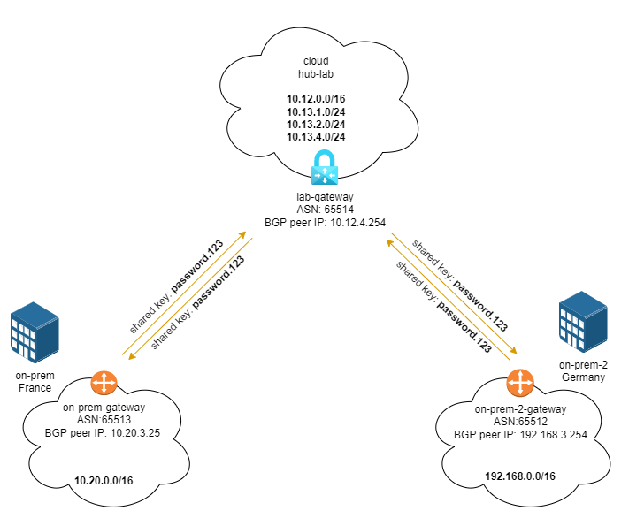

# SOLUTION - enable cross on-premise communication

## Pre-requisites

in order to apply this solution you have to deploy hub, on prem and on prem 2 playgrounds.

## Solution

### Step 1 - enable BGP
In resource Group `hub-and-spoke-playground` > `lab-gateway` > Configuration:
* Configure BGP: **ENABLE**
* ASN: **65514**
* BGP peer IP: **10.12.4.254**
* Save (if the portals shows an ERROR on save, just refresh the page, probably the configuration is ok anyway)

In resource Group `on-premise-playground` > `on-prem-gateway` > Configuration:
* Configure BGP: **ENABLE**
* ASN: **65513**
* BGP peer IP: **10.20.3.254**
* Save (if the portals shows an ERROR on save, just refresh the page, probably the configuration is ok anyway)

In resource Group `on-premise-2-playground` > `on-prem-2-gateway` > Configuration:
* Configure BGP: **ENABLE**
* ASN: **65512**
* BGP peer IP: **192.168.3.254**
* Save (if the portals shows an ERROR on save, just refresh the page, probably the configuration is ok anyway)

### Step 2: connecttion onprem-to-cloud
Open `on-prem-gateway`, go to Connections and add the following object
* Connection Name: `onprem-to-cloud`
* Type: **VNet-to-VNet**
* First virtual Network Gateway:  `on-prem-gateway`
* Second virtual Network Gateway: `lab-gateway`
* Shared Key: `password.123`
* BGP: **Enable**
* IKE: **IKEv2**

### Step 3: connection cloud-to-onprem
Open `lab-gateway`, go to Connections and add the following object
* Connection Name: `cloud-to-onprem`
* Type: VNet-to-VNet
* First virtual Network Gateway:  `lab-gateway`
* Second virtual Network Gateway: `on-prem-gateway`
* Shared Key: `password.123`
* BGP: **Enable**
* IKE: IKEv2

### Step 4: connection onprem-2-to-cloud
Open `on-prem-2-gateway`, go to Connections and add the following object
* Connection Name: `onprem-2-to-cloud`
* Type: **VNet-to-VNet**
* First virtual Network Gateway:  `on-prem-2-gateway`
* Second virtual Network Gateway: `lab-gateway`
* Shared Key: `password.123`
* BGP: **Enable**
* IKE: **IKEv2**

### Step 5: connection cloud-to-onprem-2
Open `lab-gateway`, go to Connections and add the following object
* Connection Name: `cloud-to-onprem-2`
* Type: **VNet-to-VNet**
* First virtual Network Gateway:  `lab-gateway`
* Second virtual Network Gateway: `on-prem-gateway`
* Shared Key: `password.123`
* BGP: **Enable**
* IKE: **IKEv2**


...after few minutes you will have the following connections estabilished in `lab-gateway` > connections:

| Name | Status | Connection Type | Peer |
|---|---|---|---|
|cloud-to-onprem | connected  |VNet-toVNet| on-prem-gateway |
|cloud-to-onprem-2 | connected  |VNet-toVNet| on-prem-2-gateway |
|onprem-to-cloud | connected |VNet-toVNet| on-prem-gateway |
|onprem-2-to-cloud | connected |VNet-toVNet| on-prem-2-gateway |




## Test solution
Verify in `lab-gateway` > BGP peers:

| peer addr | local addr | ASN | Status | 
|---|---|---|---|
| 10.20.3.254 | 10.12.4.254 | 65512 | connected |
| 192.168.3.254 | 10.12.4.254 | 65513 | connected |

and learned routes

| Network | next hop | src peer | origin | AS path |
|---|---|---|---|---|
| 10.12.0.0/16 | - | 10.12.4.254 | network | |
| 10.13.2.0/16 | - | 10.12.4.254 | network | |
| 10.13.1.0/16 | - | 10.12.4.254 | network | |
| 10.13.3.0/16 | - | 10.12.4.254 | network | |
| 192.168.3.254/32 | - | 10.12.4.254 | network | |
| 192.168.0.0/16 | 192.168.3.254 | 192.168.3.254 | Ebgp | 65513 |
| 10.20.3.254/32 | - | 10.12.4.254 | network | |
| 10.20.0.0/16 | 10.20.3.254 | 10.20.3.254 | Ebgp | 65512 |

Verify in `on-premise-gateway` > BGP peers:

| peer addr | local addr | ASN | Status | 
|---|---|---|---|
| 10.12.4.254 | 192.168.3.254 | 65514 | connected |

and learned routes

| Network | next hop | src peer | origin | AS path |
|---|---|---|---|---|
| 192.168.0.0/16 | - | 192.168.3.254 | network | - |
| 10.12.4.254/32 | - | 192.168.3.254 | network | - |
| 10.12.0.0/16 | 10.12.4.254 | 10.12.4.254 | Ebgp | 65514 |
| 10.13.2.0/16 | 10.12.4.254 | 10.12.4.254 | Ebgp | 65514 |
| 10.13.1.0/16 | 10.12.4.254 | 10.12.4.254 | Ebgp | 65514 |
| 10.13.3.0/16 | 10.12.4.254 | 10.12.4.254 | Ebgp | 65514 |
| 10.20.0.0/16 | 10.12.4.254 | 10.20.3.254 | Ebgp | 65514-65512 |

connect via SSH to `lin-onprem` machine onprem-2 and check RDP connection to `W10-onprem` machine: 

```
nicola@lin-onprem:~$ telnet 192.168.1.4 3389
```

if the routing works you will receive the following message:

```
Trying 192.168.1.4...
Connected to 192.168.1.4.
Escape character is '^]'.
^CConnection closed by foreign host.
```

## More information
* BGP in Azure VPN Gateway Context: https://docs.microsoft.com/en-us/azure/vpn-gateway/vpn-gateway-bgp-overview
* How to configure BGP: https://docs.microsoft.com/en-us/azure/vpn-gateway/bgp-howto
