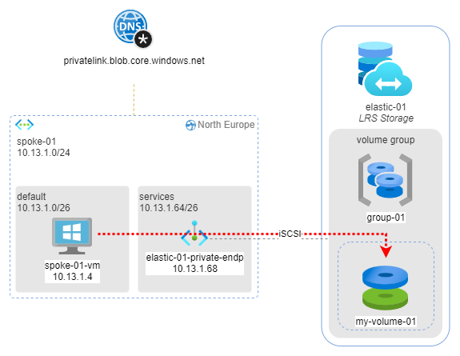

# SOLUTION: create an Azure Elastic SAN and connect it to your Windows Server virtual machine

Azure Elastic SAN is a fully integrated solution that simplifies deploying, scaling, managing, and configuring a storage area network (SAN), while also offering built-in cloud capabilities like high availability. Elastic SAN is interoperable with multiple types of compute resources such as Azure Virtual Machines, Azure VMware Solutions, and Azure Kubernetes Service.

Azure Elastic SAN volumes can connect to a wide variety of compute resources using the Internet Small Computer Systems Interface (iSCSI) protocol. Because of this, rather than having to configure storage for each of your compute options, you can configure an Elastic SAN to serve as the storage solution for multiple compute options and manage it separately from each option.

With an Elastic SAN, it's possible to scale your performance up to millions of IOPS, with double-digit GB/s throughput, and have single-digit millisecond latency. You can either increase your performance along with the storage capacity or increase the storage capacity without increasing the SAN's performance, potentially offering a lower total cost of ownership.

One Elastic SAN can have one or more **Volume Groups**. 
One Volume Group can have one or more **Volumes**. A Volume Group is a management construct that you use to manage volumes at scale. Any settings or configurations applied to a Volume Group, such as virtual network rules, are inherited by any volumes associated with that Volume Group. 

A volume is a partition of the SAN's storage capacity.

**In this page, I show how to connect an Azure Elastic SAN volume to a Windows Server 
virtual machine on Azure using the iSCSI protocol. **
The Elastic SAN and the Virtual Machine are in the context of a hub and spoke architecture, so all the communication between the VM and the virtual SAN will occur through a private virtual network.

The target architecture will be the following:



_Download a [draw.io file](../images/elastic-san.drawio) of this schema._

## Pre-requisites

In order to apply this solution you have to deploy the `hub-playground` only. 
FOr this sample I have installed all hub's`` resources in `northeurope`.

## Solution
Go to Elastic SANs > Create.

* Name: `elastic-01`
* Region: `north europe`
* Redundancy: `LRS`
* Resource provisioning on Elastic SAN:
  * Base: `1TiB`
  * Additional: `10TiB`
* click CREATE

Go to Elastic SANs > `elastic-01` > Networking and `disable` the public network access.

### Create a Volume Group and Volume
Go to Elastic SANs > `elastic-01` > Volume groups > create

* Name: `group-01`
* Networking > create private endpoint
  * Location: `north europe`
  * Name: `elastic-01-private-endp`
  * Volume Group: `group-01`
  * Virtual Network: `spoke-01`
  * Subnet: `services`
  * Integrate with privare DNS zone: `yes` (`privatelink.blob.core.windows.net`)
* click CREATE

Go to Elastic SANs > `elastic-01` > Volumes > Create Volume

* Volume Group: `group-01`
* Name: `my-volume-01` 
* Source Type: `None`
* Size: `10 GiB`
* click CREATE

Go to Private DNS Zones > `privatelink.blob.core.windows.net` > Virtual Network Link > Add

* Link Name: `spoke-01-network-link`
* Virtual Network: `Spoke-01`
* click **CREATE**

## Test solution

Go to Virtual Machines > `spoke-01-vm` > connect via bastion

Open a `run as administrator` powershell ISE

Install Multipath I/O, enable multipath support for iSCSI devices, and set a default load balancing policy using the following script:

```
# Confirm iSCSI is running
Get-Service -Name MSiSCSI

# If it's not running, start it
Start-Service -Name MSiSCSI

# Set it to start automatically
Set-Service -Name MSiSCSI -StartupType Automatic

# Install Multipath-IO
Add-WindowsFeature -Name 'Multipath-IO'

# Verify if the installation was successful
Get-WindowsFeature -Name 'Multipath-IO'

# Enable multipath support for iSCSI devices
Enable-MSDSMAutomaticClaim -BusType iSCSI

# Set the default load balancing policy based on your requirements. In this example, we set it to round robin
# which should be optimal for most workloads.
mpclaim -L -M 2
```

Go to Elastic SANs > `elastic-01` > Volumes > `my-volume-01` > Connect > Windows tab > View the code > copy to clipboard.

Paste the code on the same powershell in a new script page, save it as e `.ps1` file and execute it. 

output will be similar to the following:

```
my-volume-01 [iqn.xxxx-xx.net.windows.core.blob.ElasticSan.es-zzzzzzzzzz:my-volume-01]: Connecting to this volume
Microsoft iSCSI Initiator Version 10.0 Build 17763

The operation completed successfully. 

...

```

`iSCSI initiator` app on the virtual machine can give you more information about the virtual SAN connected to the server.

The disk from elastic SAN is now available as storage in Windows.

Go to Start menu > Disk Management: a popup will show you that a new disk is available. Select OK.

In the list of disks you will se a Basic 10Gb Disk available and unallocated. 
Now you can format it and use as local storage of the machine.

# More information

* <https://learn.microsoft.com/en-us/azure/storage/elastic-san/>
* <https://learn.microsoft.com/en-us/azure/storage/elastic-san/elastic-san-connect-windows>
* <https://it.wikipedia.org/wiki/Internet_Small_Computer_Systems_Interface>
  
