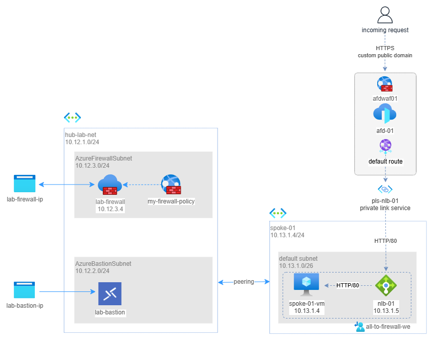

# SOLUTION: Expose via Azure Front Door an internal web server located on a VM on a spoke

This scenario demonstrates how to securely expose an internal web server using Azure Front Door without directly exposing the VM it to the internet.

Azure Front Door is a modern cloud Content Delivery Network (CDN) service that provides fast, reliable, and secure access to your global applications. 
It operates at the edge of Microsoft's global network, directing web traffic to the fastest and most available application backend. 
Front Door provides your users with a global, scalable, and secure entry point to your web applications.

Keeping the origin server (backend) private offers several security benefits:

1. **Reduced attack surface**: Prevents direct attacks on your origin infrastructure
2. **DDoS protection**: Front Door helps mitigate DDoS attacks by absorbing traffic at the edge
3. **Enhanced security posture**: Implements defense-in-depth by hiding your backend resources
4. **Enforced traffic routing**: All traffic must pass through Front Door's security controls
5. **Centralized WAF protection**: Web Application Firewall can filter malicious traffic at the edge

Azure Frontdoor, Azure Application gateway and Azure Load balancers all allow to expose an internal resource on internet. When choose azure frontdoor vs Application gatewa or Azure load balancers?

Azure Frontdoor and Azure Application gateway, While both services provide WAF and routing capabilities, they have different strengths:

- **Global vs Regional**: Front Door is a global service, while Application Gateway is regional
- **Edge security**: Front Door filters traffic at Microsoft's edge locations worldwide
- **Scalability**: Front Door auto-scales globally without manual intervention
- **Protocol optimization**: Front Door optimizes HTTP/S protocols over Microsoft's global network
- **Multi-region architecture**: Better suited for applications with global reach and multi-region backends

Azure Front Door provides also several advantages over a simple public load balancer:

- **Content delivery network**: Caches content closer to users for faster delivery
- **SSL offloading**: Handles SSL/TLS termination at the edge
- **Intelligent routing**: Directs users to closest/healthiest backend
- **Security features**: Built-in WAF capabilities to protect against web vulnerabilities
- **Global health probes**: Continuous monitoring of backend health across regions

The final architecture involves the following resources:

- Azure Front Door Premium with WAF
- Private Link Service
- Internal Load Balancer
- Virtual Machine in a spoke network running a web server

as shown below:



_Download a [draw.io file](../images/frontdoor.drawio) of this schema._

## Pre-requisites

In order to apply this solution you have to deploy the `hub-playground` only. 
For this sample I have installed all hub's resources in `northeurope`.

## Solution

### Activate a web server on `spoke-01-vm`

Go to Azure Portal > virtual machines > spoke-01-vm > connect via bastion

Once logged in, open PowerShell and type the following:

``` powershell
Install-WindowsFeature -name Web-Server -IncludeManagementTools
Remove-Item -Path 'C:\inetpub\wwwroot\iisstart.htm'
Add-Content -Path 'C:\inetpub\wwwroot\iisstart.htm' -Value $($env:computername)
```

### Create an internal load balancer

Go to Azure Portal > Load balancers > Create > standard load balancer

#### Basic
* Name: `nlb-01`
* Region: `northeurope`

#### Frontend IP configuration

Add frontend IP Configuration:
* Name: `nlb-frontend-01`
* IP version: IPv4
* Virtual network: `spoke-01`
* Subnet: `default`
* Assignment: Dynamic
* Availability zone: Zone redundant


#### Backend pools

Add a backend pool: 
* Name: `nlb-backend-01`
* Backend pool configuration: NIC
  * Resource name: `spoke-01-vm`
* Click **SAVE**

#### Inbound rules

Add a load balancing rule:

* Name: `lb-rule-01`
* IP version: IPv4
* Frontend IP address: `nlb-frontend-01`
* Backend pool: `nlb-backend-01`
* Protocol: TCP
* Inbound port: `80`
* Backend port: `80`
* Create a new health probe:
  * Name: `probe-01`
  * Protocol: HTTP
  * Port: `80`
  * Path: `/`
  * Interval: `5` sec
  * Click **SAVE**
* Click **SAVE**

#### Outbound rule

None.

#### Review and create

Click **CREATE**

### Create a Private Link Service

Go to Azure Portal > Private Link Services > Create

#### Basics
* Name: `pls-nlb-01`
* Region: `northeurope`

#### Outbound settings
* Load Balancer: `nlb-01`
* Load balancer frontend IP address: `10.13.1.5`
* Source NAT subnet: `default`

#### Review and create
Click **CREATE**.

### Create an Azure Front Door

Go to Azure Portal > Front Doors > Create > Azure Front Door/quick create

#### Configuration
* Name: `afd-01`
* Tier: Premium
* Endpoint name: `afd-01`
* SKU: Standard
* Origin type: Custom
* Origin host name: `10.13.1.5` (internal load balancer, front end IP)
* Private link service: ENABLE
* Select private link: In my directory
* Resource: `pls-nlb-01`
* Request message: `please approve me`
* WAF policy: Create new:
  * Name: `afdwaf01`
  * Bot protection: ON
  * Click **CREATE**
* Click **CREATE**

Go to Azure Portal > Private Link Services > **pls-nlb-01** > Private endpoint connections. 
You will find 1 private endpoint connection, select it, then click to **APPROVE**

The connection state should change to Approved. It might take a couple of minutes for the connection to fully establish. 
You can now access your internal load balancer from Azure Front Door.

Go to Azure Portal > **afd-01** > Front Door Manager > **default-route** > Update and change forwarding protocol to **HTTP only** (because your backend VM exposes an HTTP-only web server).

## Test solution
Because Azure Front Door is a globally distributed service, each update can require up to 10-20 minutes to propagate everywhere. After this time, open the `afd-01` endpoint hostname public URL found on the overview page (something like `https://afd-01-abcefgh.b01.azurefd.net`). You will see `spoke-01-vm` displayed in your browser.

## More information

* [Azure Front Door with Private Link](https://learn.microsoft.com/en-us/azure/frontdoor/private-link)
* [Creating a Private Link Service](https://learn.microsoft.com/en-us/azure/private-link/create-private-link-service-portal?tabs=dynamic-ip)
* [Enabling Private Link with internal load balancers](https://learn.microsoft.com/en-us/azure/frontdoor/standard-premium/how-to-enable-private-link-internal-load-balancer)