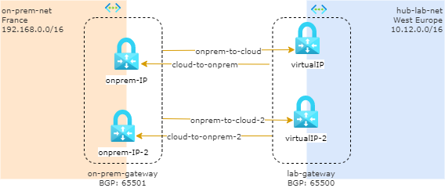

# SOLUTION: connect on-prem and hub with a Site-to-Site VPN with dual-redundancy, ACTIVE-ACTIVE connection 

## Pre-requisites

In order to apply this solution you have to deploy `hub` and `on-premises` playgrounds.

## Solution
Here you create and set up the Azure VPN gateway in an active-active configuration, and create two local network gateways and two connections for your two on-premises VPN devices as described above. The result is a full mesh connectivity of 4 IPsec tunnels between your Azure virtual network and your on-premises network.

All gateways and tunnels are active from the Azure side, so the traffic will be spread among all 4 tunnels simultaneously, although each TCP or UDP flow will again follow the same tunnel or path from the Azure side. Even though by spreading the traffic, you may see slightly better throughput over the IPsec tunnels, the primary goal of this configuration is for high availability. And due to the statistical nature of the spreading, it is difficult to provide the measurement on how different application traffic conditions will affect the aggregate throughput.

This topology will require **two local network gateways** and **two connections** to support the pair of on-premises VPN devices, and **BGP is required** to allow the two connections to the same on-premises network. 

More information on [dual-redundancy, active-active VPN gateways for both Azure and on-premises networks](https://docs.microsoft.com/en-us/azure/vpn-gateway/vpn-gateway-highlyavailable#dual-redundancy-active-active-vpn-gateways-for-both-azure-and-on-premises-networks).

### Enable Active-Active mode
Go to Virtual Network Gateway `lab-gateway` in Configuration:
* Active-active mode: Enables
* Second Public IP Address: `hub-gateway-virtualip-2` 
  * SKU: Basic
* Configure BGP: enabled
  * ASN: 65513
* Click *Save* 

Go to Virtual Network Gateway `on-prem-gateway` in Configuration:
* Active-active mode: Enables
* Second Public IP Address: `onprem-gateway-virtualip-2` 
  * SKU: Basic
* Configure BGP: enabled
  * ASN: 65514
* Click *Save*

# create Local Network Gateways
create the following gateways

| Name | IP Address | Address Space | Region | Configure BGP | ASN | BGP peer IP addr |
|---|---|---|---|---|---|---|
|cloud-net | (hub-gateway-virtualip) | 10.0.0.0/8| West Europe | yes | 65513 | 10.12.4.4 |
|cloud-net-2 | (hub-gateway-virtualip-2) | 10.0.0.0/8| West Europe | yes | 65513 | 10.12.4.5 |
|onprem-net| (onprem-gateway-virtualip) | 192.168.0.0/16 | France Central | yes | 65514 | 192.168.3.4 |
|onprem-net-2| (onprem-gateway-virtualip-2) | 192.168.0.0/16 | France Central | yes | 65514 | 192.168.3.5 |

> BGP peer IP addr is th "[default|second] Azure BGP peer IP address" you can see in Azure Virtual Network Gateway > Configuration pane 

# connection onprem-to-cloud
Open `on-prem-gateway`, go to Connections and add the following object:

* Connection Name: `onprem-to-cloud`
* Type: Site-to-Site (IPsec)
* virtual Network Gateway:  `on-prem-gateway`
* Local Network Gateway: `cloud-net`
* Shared Key: `password.123`
* Enable BGP: true
* IKE: IKEv2

# connection cloud-to-onprem
Open `lab-gateway`, go to Connections and add the following object:

* Connection Name: `cloud-to-onprem`
* Type: Site-to-Site (IPsec)
* virtual Network Gateway:  `lab-gateway`
* Local Network Gateway: `onprem-net`
* Shared Key: `password.123`
* Enable BGP: true
* IKE: IKEv2

# connection onprem-to-cloud-2
Open `on-prem-gateway`, go to Connections and add the following object:

* Connection Name: `onprem-to-cloud-2`
* Type: Site-to-Site (IPsec)
* virtual Network Gateway:  `on-prem-gateway`
* Local Network Gateway: `cloud-net-2`
* Shared Key: `password.123`
* Enable BGP: true
* IKE: IKEv2

# connection cloud-to-onprem-2
Open `lab-gateway`, go to Connections and add the following object:

* Connection Name: `cloud-to-onprem-2`
* Type: Site-to-Site (IPsec)
* virtual Network Gateway:  `lab-gateway`
* Local Network Gateway: `onprem-net-2`
* Shared Key: `password.123`
* Enable BGP: true
* IKE: IKEv2

after few minutes, you will see, on  `on-prem-gateway` connections:

| Name | Status | Connection Type | Peer |
|---|---|---|---|
|onprem-to-cloud | connected  |Site-to-Site (IPsec)| cloud-net|
|onprem-to-cloud-2 | connected  |Site-to-Site (IPsec)| cloud-net-2|

and on `lab-gateway` connections:

| Name | Status | Connection Type | Peer |
|---|---|---|---|
|cloud-to-onprem | connected  |Site-to-Site (IPsec)| onprem-net |
|cloud-to-onprem-2 | connected  |Site-to-Site (IPsec)| onprem-net |

## Test solution
Via bastion go to W10onprem (`192.168.1.4`) and open a RDP connection to hub-vm-01 (`10.12.1.4`).

Do the same test also from hub-vm-01 to W10onprem.
