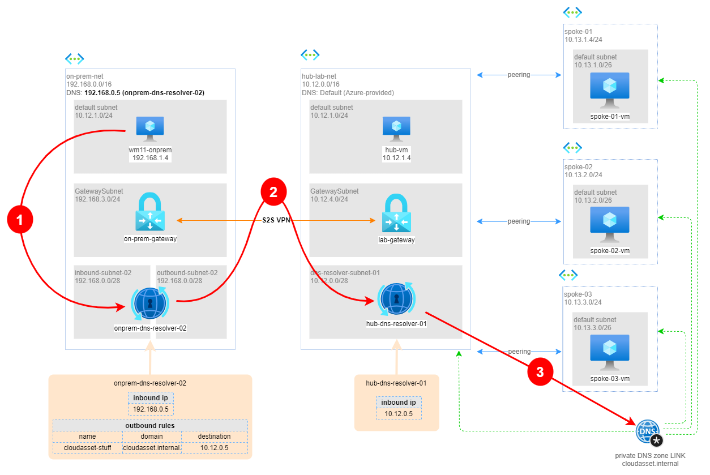

# SOLUTION: Configure a DNS on the cloud, and be sure that all machines are reachable via FQDN also from on-premise (DNS Resolver version)

In this walktrough I show how use an [Azure private DNS resolver](https://learn.microsoft.com/en-us/azure/dns/dns-private-resolver-overview) and [Azure private DNS zone](https://learn.microsoft.com/en-us/azure/dns/private-dns-privatednszone) to allow DNS name resolution between on-premises and a hub-and-spoke architecture on Azure, connected via a S2S VPN.

Since the on-premise network is also implemented on Azure, I plan to use an instance of Azure Private DNS resolver on this side as well. In a real-world scenario, the on-premise network would likely have a more traditional DNS server configured properly.

> The hub and spoke network is a network topology that helps in the organization of virtual networks. The hub acts as a central point of communication while the spokes connect to the hub, thereby forming a hub and spoke architecture. Additionally, organizations can also connect their on-premises network with the Azure hub and spoke network to create a hybrid architecture.

While using the hub and spoke network, it is essential to enable communication between the cloud resources and on-premises resources. This communication requires a naming resolution system that can resolve domain names to IP addresses. The Azure Private DNS resolver can help with this, allowing for the resolution of domain names to IP addresses.

**Azure Private DNS resolver** is a Platform-as-a-Service (PaaS) offering that provides scalable and high-performance DNS resolution for virtual networks. Unlike a VM with DNS on it, it is not necessary to manage and maintain the infrastructure required for a PaaS private resolver. The PaaS private resolver offers many advantages such as built-in security features, the ability to configure custom domain names, and integration with other Azure services. Additionally, PaaS private resolver can scale automatically, allowing for quick provisioning of DNS resolution resources as needed. Overall, PaaS private resolver is a more efficient and scalable solution than a VM with DNS on it.

**Azure Private DNS zone** provides a reliable, secure DNS service to manage and resolve domain names in a virtual network without the need to add a custom DNS solution. By using private DNS zones, you can use your own custom domain names rather than the Azure-provided names available today. You can link a private DNS zone to one or more virtual networks by creating virtual network links. You can also enable the autoregistration feature to automatically manage the life cycle of the DNS records for the virtual machines that get deployed in a virtual network.

This "solutution" implements the following:



We have an on-premise network connected to a hub on Azure. the hub have 3 spokes, each with a VM installed. Azure private DNS zone service with auto registration enabled allows to populate the DNS with all the required information. Once the private DNS zone is associated to a specific virtual network, the default Azure DNS is able to resolve al the names on the private zone. 

The DNS query process when using an Azure DNS Private Resolver is summarized below:

1. A client in a virtual network issues a DNS query.
2. If the DNS servers for this virtual network are specified as custom, then the query is forwarded to the specified IP addresses.
3. If Default (Azure-provided) DNS servers are configured in the virtual network, and there are Private DNS zones linked to the same virtual network, these zones are consulted.
4. If the query doesn't match a Private DNS zone linked to the virtual network, then Virtual network links for DNS forwarding rulesets are consulted.
5. If no ruleset links are present, then Azure DNS is used to resolve the query.
6. If ruleset links are present, the DNS forwarding rules are evaluated.
7. If a suffix match is found, the query is forwarded to the specified address.
8. If multiple matches are present, the longest suffix is used.
9. If no match is found, no DNS forwarding occurs and Azure DNS is used to resolve the query.

 In this scenario, the private DNS resolver on-premise is forwarding DNS queries for the `cloudasset.internal` zone to the Azure Private DNS resolver in the hub. The Azure Private DNS resolver in the hub then forwards the query to the Azure default DNS, which knows about the `cloudasset.internal` zone because of the private zone link that has been configured. This allows for successful resolution of cloud resources from the on-premises network.

## Pre-requisites

1. deploy HUB playground
2. deploy ONPREMISE-2 playground
3. configure a site-to-site VPN as [documented here](vnet-to-vnet-2.md)
4. configure a DNS in the cloud [as documented here](dns.md)

## Solution

### Create subnet for DNS Resolver in the Hub and on-premise
Open Virtual Networks > `hub-lab-net` > Subnet > add subnet:
* Name: `dns-resolver-subnet-01`
* Subnet address range: `10.12.0.0/28`

Open Virtual Networks > `onprem-net` > Subnet > add subnet:
* Name: `inbound-subnet-02`
* Subnet address range: `192.168.0.0/28`

Open Virtual Networks > `onprem-net` > Subnet > add subnet:
* Name: `outbound-subnet-02`
* Subnet address range: `192.168.0.16/28`


### Create DNS resolver in the cloud
Open DNS private resolvers > Create
* Name: `hub-dns-resolver-01`
* v-net: `hub-lab-net`
* Inbound endpoint:
  * name: `inbound-endpoint-01`
  * subnet: `dns-resolver-subnet-01`
  * IP: static > `10.12.0.5`
* CREATE

### create DNS resolver on-premise
Open DNS private resolvers > Create
* Name: `onprem-dns-resolver-02`
* v-net: `on-prem-net`
* Inbound endpoint:
  * name: `inbound-endpoint-02`
  * subnet: `inbound-subnet-02`
  * IP: static > `192.168.0.5`
* Outbound endpoint:
  * name: `outbound-endpoint-02`
  * subnet: `outbound-subnet-02`
* Ruleset > Add:
  * Name: `ruleset-01`
  * Endpoint(s): `outbound-subnet-02`
  * Rules: Add
    * Name: `cloudasset-stuff`
    * Domain: `cloudasset.internal.`
    * Destination: `10.12.0.5:53` (inbound IP DNS resolver in cloud)
* CREATE

### configure new on-prem DNS server

Open virtual networks > `on-prem-net` > DNS servers > `192.168.0.5` (onprem DNS resolver inbound IP) 

Reboot `W11-onprem` VM.

## Test solution
via RDP Bastion, connect to `wm11-onprem` machine.
Open command prompt and type:

```
nslookup spoke-01-vm.cloudasset.internal
nslookup spoke-02-vm.cloudasset.internal
nslookup spoke-03-vm.cloudasset.internal
nslookup hub-vm.cloudasset.internal
```

you will be able to resolve names as shown below.

```
C:\Users\nicola>nslookup spoke-01-vm.cloudasset.internal
Name:    spoke-01-vm.cloudasset.internal
Address:  10.13.1.4

C:\Users\nicola>nslookup spoke-02-vm.cloudasset.internal
Name:  spoke-02-vm.cloudasset.internal
Address:  10.13.2.4

C:\Users\nicola>nslookup spoke-03-vm.cloudasset.internal
Name:  spoke-03-vm.cloudasset.internal
Address:   10.13.3.4

C:\Users\nicola>nslookup hub-vm.cloudasset.internal
Name:    hub-vm.cloudasset.internal
Address:  10.12.1.4
```
