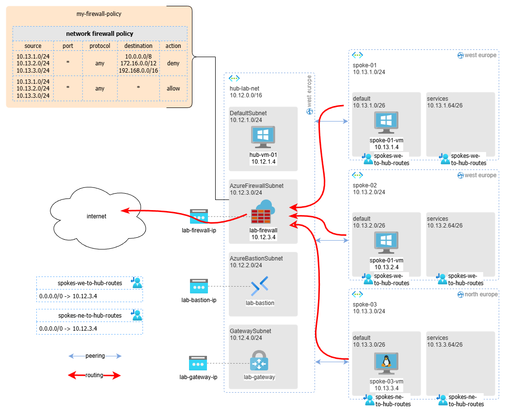

# Using Azure Firewall as a Gateway for All Outbound Traffic to the Internet

Managing and securing outbound traffic is crucial for maintaining the integrity and performance of your network. Azure Firewall can be effectively used as a gateway for all outbound traffic to the internet. 

[Azure Firewall](https://learn.microsoft.com/en-us/azure/firewall/overview) is a managed, cloud-based network security service that protects your Azure Virtual Network resources. It is a stateful firewall as a service with built-in high availability and unrestricted cloud scalability. Azure Firewall provides both network and application-level protection across different subscriptions and virtual networks.

Benefits of Using Azure Firewall for Outbound Traffic

* Centralized Security Management: Azure Firewall allows you to manage and enforce [security policies](https://learn.microsoft.com/en-us/azure/firewall/policy-rule-sets) centrally, ensuring consistent security across your network.
* Scalability: Azure Firewall [scales automatically](https://learn.microsoft.com/en-us/azure/firewall/firewall-performance) to meet your changing network traffic needs, providing high availability and resilience.
* Advanced Threat Protection: With features like threat [intelligence-based filtering](https://learn.microsoft.com/en-us/azure/firewall/threat-intel), Azure Firewall can detect and block traffic from known malicious IP addresses and domains.
* Integration with Other Azure Services: Azure Firewall integrates seamlessly with other Azure services like [Azure Monitor](https://learn.microsoft.com/en-us/azure/azure-monitor/fundamentals/overview), [Azure Sentinel](https://learn.microsoft.com/en-us/azure/sentinel/overview), and Azure Security Center, providing comprehensive security insights and management.

In this walkthrough, I will show you how to set up Azure Firewall for this purpose.

The target architecture will be the following:

_Download a [draw.io file](../images/outbound-traffic-internet-firewall.drawio) of this schema._

## Pre-requisites

## Solution

## Test solution