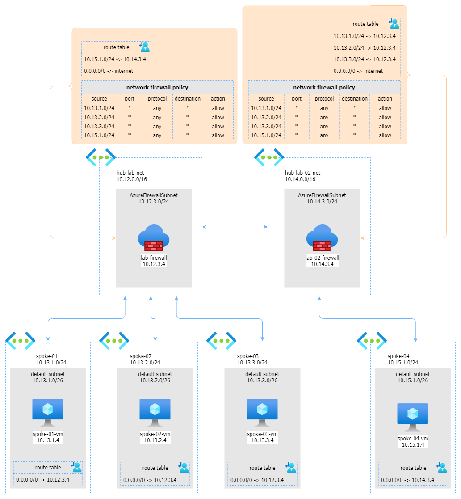

# SOLUTION: Routing cross hubs without BGP

This solution shows how to configure routing between all spokes of two network hubs, using Azure Firewalls and virtual network peerings as shown in the following schema.

_Download a [draw.io file](../images/routing-without-bgp-fw.drawio) of this architecture._

## Pre-requisites

In order to apply this solution:

* deploy the `hub playground`
* deploy the `hub 02 playground`

## Solution

Once both deployments are completed, the following steps are required to enable routing between all spokes:

1. create a peering between `hub-lab-net` and `hub-lab-02-net`
2. forward all traffic from spokes to the corresponding Azure Firewall
3. Configure routing between the 2 firewalls
4. Configure a network policy on each firewall that allows the transit

### Create a peering between `hub-lab-net` and `hub-lab-02-net`

Go to `hub-lab-net` > Peerings and click to **add**:

* Peering Network Name: `hub-to-hub-02`
* Traffic to remote virtual network: `allow`
* Traffic forwarded from remote virtual network: `allow`
* Virtual network gateway or Route Server `none`
* Remote virtual network Peering link name: `hub-02-to-hub`
* Virtual Network: `hub-lab-02-net`
* Traffic to remote virtual network: `allow`
* Traffic forwarded from remote virtual network: `allow`
* Virtual network gateway or Route Server `none`

click **add**

### Forward all traffic from spokes to the corresponding Azure Firewall

Create the following route tables:

* route table name: `all-to-fw-westeurope`
* Region: `west europe`

Routes

| Name | Address prefix | Next hop type | Next hop IP address | 
|---|---|---|---|
| all | 0.0.0.0/0 | Virtual appliance | 10.12.3.4 |

Subnets

| Network | subnet |
|---|---|
| spoke-01 | default |
| spoke-01 | services|
| spoke-02 | default |
| spoke-02 | services|

* route table name: `all-to-fw-northeurope`
* region: `north europe`

Routes

| Name | Address prefix | Next hop type | Next hop IP address | 
|---|---|---|---|
| all | 0.0.0.0/0 | Virtual appliance | 10.12.3.4 |

Subnets

| Network | subnet |
|---|---|
| spoke-03 | default |
| spoke-03 | services|

* route table name: `all-to-fw-northeurope-02`
* region: `north europe`

Routes

| Name | Address prefix | Next hop type | Next hop IP address | 
|---|---|---|---|
| all | 0.0.0.0/0 | Virtual appliance | 10.14.3.4 |

Subnets

| Network | subnet |
|---|---|
| spoke-04 | default |
| spoke-04 | services|

### Configure routing between the 2 firewalls

Create the following route tables:

* route table name: `firewall-hub`
* Region: `west europe`

Routes

| Name | Address prefix | Next hop type | Next hop IP address | 
|---|---|---|---|
| all1 | 10.15.1.0/24 | Virtual appliance | 10.14.3.4 |
| all | 0.0.0.0/0 | internet |  |

Subnets

| Network | subnet |
|---|---|
| hub-lab-net | AzureFirewallSubnet |

* route table name: `firewall-hub-02`
* Region: `north europe`

Routes

| Name | Address prefix | Next hop type | Next hop IP address | 
|---|---|---|---|
| all1 | 10.13.1.0/24 | Virtual appliance | 10.12.3.4 |
| all2 | 10.13.2.0/24 | Virtual appliance | 10.12.3.4 |
| all3 | 10.13.3.0/24 | Virtual appliance | 10.12.3.4 |
| all | 0.0.0.0/0 | internet |  |

Subnets

| Network | subnet |
|---|---|
| hub-lab-02-net | AzureFirewallSubnet |

### Configure a network policy on each firewall that allows the transit

Create the following Azure IP Group:

* Name: `all-spokes-ipg`
* region: `west europe`
* IP Addresses:
  * 10.13.1.0/24
  * 10.13.2.0/24
  * 10.14.3.0/24
  * 10.15.1.0/24

Create the following Firewall Policy:

* Name: `my-firewall-policy`
* policy tier: `standard`
* add rules collection:
  * name: `my-rule-collection`
  * type: `network`
  * priority: `1000`
  * action: `allow`

Rules
| Name | Source type | Source | Protocol | Destination Ports | Destination Type | Destination 
|---|---|---|---|---|---|---|
| all | ipgroup | `all-spokes-ipg` | any | * | ip address | * |

associate this policy to both firewalls:

* Azure Firewall Manager -> Virtual Networks -> `hub-lab-net` -> Security Provider -> Add Policy -> `my-firewall-policy` 
* Azure Firewall Manager -> Virtual Networks -> `hub-lab-02-net` -> Security Provider -> Add Policy -> `my-firewall-policy`

## Test Solution
Now a machine connected to the `spoke-01` virtual network can connect to a machine connected to the `spoke-04` networrk.

1. connect to `spoke-01-vm` via RDP/bastion 
2. once on the vm, open remote desktop connection and connect to `10.11.1.4` (a Windows VM)

As bonus, because we also enabled outbound internet traffic from all spokes via firewalls, open Microsoft Edge and be sure you are able to open a web site.