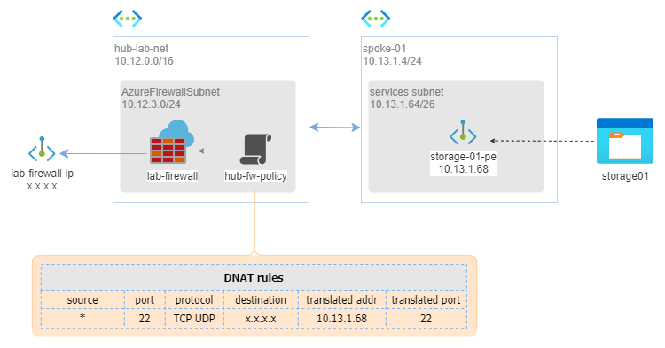

# SOLUTION: Publish internal SFTP endpoint via Azure Firewall

In this solution I show how to publish through Azure Firewall an SFTP endpoint delivered by an Azure Storage.

The service is exposed by the Azure Firewall public IP.

The scenario is deployed into a Hub and Spoke network topology context. Specifically, the virtual network that hosts the Azure Storage is different from the virtual network that hosts the Azure Firewall.

In this configuration, inbound SFTP traffic goes through both Azure Firewall, the peering, the spoke and finally the Azure Storage thanks to the private endpoint.

The resulting overall architecture is shown in the following schema.



_Download a [draw.io file](../images/sftp.drawio) of this architecture._

## Pre-requisites

In order to apply this solution you have to deploy HUB playground only.

## Solution

### Create Storage Account

From Azure Portal go to Storage Accounts > Create:

Basic

* Storage account Name: `storage01`
* Region: `west europe`
* Redundancy: `LRS`

Advanced

* Hierarchical namespace: `Enable`
* SFTP: `Enable`

Networking

  * Networking access: `disable public access`
  * Private endpoint > Add private endpoint
    * Location: `West Europe`
    * Name: `storage-01-pe`
    * Storage sub resource: `blob`
    * Virtual network: `spoke-01`
    * Subnet: `Services`
    * Private DNS zone: `No`
  
  * click [Create]

### Configure Storage Account

From Azure Portal go to Storage accounts > `storage01` > Containers > Create

* Name: `test-container-01`

Click [Create].

From Azure Portal go to Storage accounts > `storage01` > SFTP > Add local user

* username: `user01`
* Authentication method: `SSH Password`
* Container permissiona
  * Container: `test-container-01`
  * Permissions: `All`

click [Add] and copy the generated password.

### Configure Azure Firewall

Go to Azure Portal > Firewall Policies > Create:

Basic Tab

* Name: `hub-fw-policy`
* Region: `West Europe`
* Parent Policy: 

Rules Tab

**DNAT rules**

|priority | collection name | rule name | src | port | protocol | destination | translated address| translated port | action |
|---|---|---|---|---|---|---|---|---|---|
|1000     | coll01          |sftp | *   | 22 | TCP UDP      | `x.x.x.x`   | `10.13.1.68`         | 22            | Dnat   |

Where:

* `x.x.x.x` is `lab-firewall` public IP 
* `10.13.1.68` is `storage-01-pe`'s private IP.
  
Click [Create].

Associate the policy `hub-fw-policy` to `lab-firewall` via Firewall Manager


## Test solution
from internet, from your laptop:

```
C:>sftp storage01.test-container-01.user01@x.x.x.x
ECDSA key fingerprint is SHA256:0WNMHmCNJE1YFBpHNeADuT5h+PfJ/jJPtUDHCxCSrO0.
This key is not known by any other names
Are you sure you want to continue connecting (yes/no/[fingerprint])?
Warning: Permanently added 'x.x.x.x' (ECDSA) to the list of known hosts.
storage01.test-container@x.x.x.x's password:
Connected to storage01.test-container-01.user01@x.x.x.x.
sftp> 

```

You can successfully connect with the sftp server.

## More information

* Azure Firewall [DNAT rules](https://learn.microsoft.com/en-us/azure/firewall/tutorial-firewall-dnat).
* Azure Storage [SFTP Support](https://learn.microsoft.com/en-us/azure/storage/blobs/secure-file-transfer-protocol-support).
* Azure [Private Endpont](https://learn.microsoft.com/en-us/azure/private-link/private-endpoint-overview).